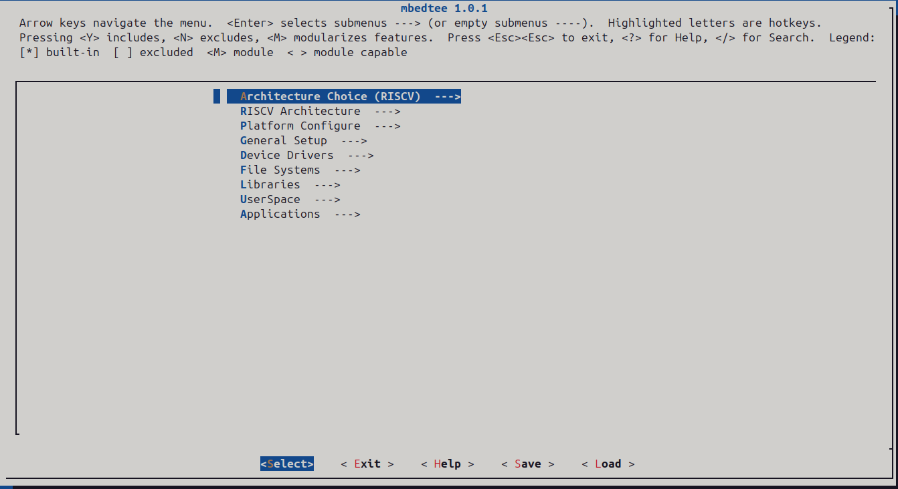

# Prerequisites

## Ubuntu24.04

For Buildroot:: 
	sudo apt-get install git make gcc g++ bzip2 libncurses-dev

For QEMU:: 
	sudo apt-get install python3-pip python3-venv python3-sphinx python3-tomli libglib2.0-dev ninja-build libpixman-1-dev libslirp-dev

For ARM-FastModel::
	sudo apt-get install xterm
	Fix the lmutil: sudo ln -s /lib64/ld-linux-x86-64.so.2 /lib64/ld-lsb-x86-64.so.3

## Ubuntu22.04

For Buildroot:: 
	sudo apt-get install git make gcc g++ libncurses-dev

For QEMU:: 
	sudo apt-get install python3-pip python3-venv python3-sphinx python3-tomli libglib2.0-dev ninja-build libpixman-1-dev libslirp-dev

For ARM-FastModel::
	sudo apt-get install xterm
	Fix the lmutil: sudo ln -s /lib64/ld-linux-x86-64.so.2 /lib64/ld-lsb-x86-64.so.3

## Ubuntu20.04

For Buildroot:: 
	sudo apt-get install git make gcc g++ libncurses-dev

For QEMU::  (ubuntu20 must use the **stable-9.0** or older version)
	sudo apt-get install python3-pip python3-venv python3-sphinx libglib2.0-dev ninja-build libpixman-1-dev libslirp-dev

For ARM-FastModel::
	sudo apt-get install xterm
	Fix the lmutil: sudo ln -s /lib64/ld-linux-x86-64.so.2 /lib64/ld-lsb-x86-64.so.3

<div STYLE="page-break-after: always;"></div>

# Quickest & Easiest Way

```
git clone https://github.com/mbedtee/mbedtee-build.git
cd mbedtee-build && ./build.sh aarch64 run
```

> [!NOTE]
>
> build.sh is just an example reference for the quick-build/run, **please refer to the following chapters for the detailed build/run commands**.

- **./build.sh aarch64** - build for the QEMU virt aarch64 platform (**build only**)
- **./build.sh aarch64 run** - build and run the QEMU virt aarch64 platform
- **./build.sh aarch32 run** - build and run the QEMU virt aarch32(arm) platform

- **./build.sh riscv64 run** - build and run the QEMU virt riscv64 platform

- **./build.sh riscv32 run** - build and run the QEMU virt riscv32 platform
- **./build.sh mips32 run** - build and run the QEMU malta mips32 platform

<u>**Take the QEMU virt AArch64 as example:**</u> 

- launches 2 gnome-terminal windows, one is for Linux@REE, another one is for the MbedTEE

  

- Following example command is for **run only**, xterm is also an alternative terminal and can be launched in the similar options.

```
gnome-terminal -e "telnet 127.0.0.1 5555" --tab -t "LinuxREE"& gnome-terminal -e "telnet 127.0.0.1 5556" --tab -t "MbedTEE"& qemu/build/qemu-system-aarch64 -M virt -M secure=on,gic-version=3,virtualization=on -cpu cortex-a710 -smp 4 -m 2048 -device loader,file=buildroot/output/images/mbedtee.bin,addr=0x80000000,force-raw=on -device loader,file=buildroot/output/images/linux.dtb,addr=0x85F00000,force-raw=on -device loader,file=buildroot/output/images/Image,addr=0x86000000,force-raw=on -device loader,addr=0x80000000,cpu-num=0 -device loader,addr=0x80000000,cpu-num=1 -device loader,addr=0x80000000,cpu-num=2 -device loader,addr=0x80000000,cpu-num=3 -serial telnet::5555,server,nowait -serial telnet::5556,server,nowait
```

<div STYLE="page-break-after: always;"></div>

# MbedTEE

## Repositories

https://github.com/mbedtee/mbedtee-build.git                                -> entry of building the mbedtee

https://github.com/mbedtee/mbedtee-docs.git                                 -> documentation of mbedtee

https://github.com/mbedtee/mbedtee-os.git                                     -> kernel of mbedtee

https://github.com/mbedtee/mbedtee-client-api.git                         -> GlobalPlatform style client API @ Linux REE

https://github.com/mbedtee/mbedtee-supp.git                                -> REEFS Supplicant System @ Linux UserSpace

https://github.com/mbedtee/mbedtee-common.git                         -> Common header files for REE and TEE

https://github.com/mbedtee/mbedtee-crypto.git                             -> Cryptographic algorithms for TA encryption and signing

https://github.com/mbedtee/mbedtee-linux-dts.git                         -> DTS for Linux REE

https://github.com/mbedtee/mbedtee-globalplatform-client.git   -> GlobalPlatform TestSuite client application @ Linux REE

https://github.com/mbedtee/mbedtee-globalplatform-ta.git         -> GlobalPlatform TestSuite TTAs @ MbedTEE

https://github.com/mbedtee/mbedtee-helloworld-client.git          -> HelloWorld client application @ Linux REE

https://github.com/mbedtee/mbedtee-helloworld-ta.git                -> HelloWorld TA @ MbedTEE

## Menuconfig

MbedTEE  provides the menuconfig for the feature configuration.

Enter the **buildroot** folder (**mbedtee-build/buildroot**), and issue the command **`make mbedtee-os-menuconfig`**



<div STYLE="page-break-after: always;"></div>

#  Build and Run @ QEMU

## Prepare the buildroot

```
git clone https://github.com/mbedtee/mbedtee-build.git
cd mbedtee-build && ./buildroot.sh
```

## Configure and Build

Enter the **buildroot** folder,  @ **mbedtee-build/buildroot**.

Select one of the following configs, issue the command (e.g. for qemu_virt_aarch64):

```
cd buildroot && make mbedtee_qemu_virt_aarch64_defconfig && make
```

**Configs to be selected for QEMU platforms:**

```
kapa@ubuntu24:~/mbedtee-build/buildroot$ tree configs/ | grep mbedtee_qemu
├── mbedtee_qemu_malta_mips32r2_defconfig
├── mbedtee_qemu_sifive_u_riscv32_defconfig
├── mbedtee_qemu_sifive_u_riscv64_defconfig
├── mbedtee_qemu_virt_aarch64_defconfig
├── mbedtee_qemu_virt_arm_defconfig
├── mbedtee_qemu_virt_riscv32_defconfig
├── mbedtee_qemu_virt_riscv32_linux_defconfig
├── mbedtee_qemu_virt_riscv64_defconfig
├── mbedtee_qemu_virt_riscv64_linux_defconfig
```

## Prepare the QEMU

Enter the **mbedtee-build** folder, clone the QEMU repository to '**mbedtee-build/qemu**'.

```
git clone https://gitlab.com/qemu-project/qemu.git
cd qemu && git checkout stable-9.0
./configure --prefix=$(pwd)/output --enable-slirp --target-list=mips64el-softmmu,mipsel-softmmu,aarch64-softmmu,arm-softmmu,riscv32-softmmu,riscv64-softmmu
make -j4 && make install
```

> [!WARNING]
>
> ubuntu20 must use the **stable-9.0** or older version, ubuntu22/24 can use the 9.1 or newer version.


## Run the targets @ QEMU

> [!NOTE]
>
> The following configs build/run the targets with MMU/UserSpace enabled, developer can disable MMU/UserSapce to run only the kernel-mode through the [menuconfig](#Menuconfig) (or disable the RISCV Supervisor-Mode/MMU/UserSpace, run only the RISCV Machine-Mode).

> [!IMPORTANT]
>
> Switch to the <u>**buildroot**</u> directory (**mbedtee-build/buildroot**) to do the config and make.
>
> “make clean” is required before switching to another target.


### AArch64 (REE+TEE)

Config/Make: make mbedtee_qemu_virt_aarch64_defconfig && make

QEMU virt AArch64 targets: -M virt -cpu cortex-a35/cortex-a53/cortex-a55/cortex-a57/cortex-a72/cortex-a76/cortex-a710/neoverse-n1/neoverse-v1/neoverse-n2

```
gnome-terminal -e "telnet 127.0.0.1 5555" --tab -t "LinuxREE"& gnome-terminal -e "telnet 127.0.0.1 5556" --tab -t "MbedTEE"& ../qemu/build/qemu-system-aarch64 -M virt -M secure=on,gic-version=3,virtualization=on -cpu cortex-a710 -smp 4 -m 2048 -device loader,file=output/images/mbedtee.bin,addr=0x80000000,force-raw=on -device loader,file=output/images/linux.dtb,addr=0x85F00000,force-raw=on -device loader,file=output/images/Image,addr=0x86000000,force-raw=on -device loader,addr=0x80000000,cpu-num=0 -device loader,addr=0x80000000,cpu-num=1 -device loader,addr=0x80000000,cpu-num=2 -device loader,addr=0x80000000,cpu-num=3 -serial telnet::5555,server,nowait -serial telnet::5556,server,nowait

or use the xterm terminal:

xterm -geometry 128x32 -e "telnet localhost 5556" & xterm -geometry 128x32 -e "telnet localhost 5555" &  ../qemu/build/qemu-system-aarch64 -M virt -M secure=on,gic-version=3,virtualization=on -cpu cortex-a710 -smp 4 -m 2048 -device loader,file=output/images/mbedtee.bin,addr=0x80000000,force-raw=on -device loader,file=output/images/linux.dtb,addr=0x85F00000,force-raw=on  -device loader,file=output/images/Image,addr=0x86000000,force-raw=on -device loader,addr=0x80000000,cpu-num=0 -device loader,addr=0x80000000,cpu-num=1 -device loader,addr=0x80000000,cpu-num=2 -device loader,addr=0x80000000,cpu-num=3 -serial telnet::5555,server,nowait -serial telnet::5556,server,nowait
```


### AArch32 (REE+TEE)

There are two kinds of QEMU platforms could run the ARM AArch32, one is "-M virt", another one is "-M vexpress-a15".

QEMU virt AArch32 targets: -M virt -cpu cortex-a15 or cortex-a7

Config/Make: make mbedtee_qemu_virt_arm_defconfig && make

```
gnome-terminal -e "telnet 127.0.0.1 5555" --tab -t "LinuxREE"& gnome-terminal -e "telnet 127.0.0.1 5556" --tab -t "MbedTEE"& ../qemu/build/qemu-system-arm -M virt -M secure=on -cpu cortex-a15 -smp 4 -m 2048 -device loader,file=output/images/mbedtee.bin,addr=0x80000000,force-raw=on -device loader,file=output/images/linux.dtb,addr=0x85F00000,force-raw=on -device loader,file=output/images/Image,addr=0x86008000,force-raw=on  -device loader,addr=0x80000000,cpu-num=0 -device loader,addr=0x80000000,cpu-num=1 -device loader,addr=0x80000000,cpu-num=2 -device loader,addr=0x80000000,cpu-num=3 -serial telnet::5555,server,nowait -serial telnet::5556,server,nowait
```

QEMU vexpress AArch32 target: -M vexpress-a15 -cpu cortex-a15 

Config/Make: make mbedtee_vexpress_ca15_defconfig && make

```
xterm -geometry 128x32 -e "telnet 127.0.0.1 5555" & xterm -geometry 128x32 -e "telnet 127.0.0.1 5556" &  xterm -geometry 128x32 -e "telnet 127.0.0.1 5557" & ../qemu/build/qemu-system-arm -M vexpress-a15 -cpu cortex-a15 -smp 4 -m 2G -device loader,file=output/images/mbedtee.bin,addr=0x80000000,force-raw=on -device loader,file=output/images/linux.dtb,addr=0x85F00000,force-raw=on -device loader,file=output/images/Image,addr=0x86008000,force-raw=on -device loader,addr=0x80000000,cpu-num=0 -device loader,addr=0x80000000,cpu-num=1 -device loader,addr=0x80000000,cpu-num=2 -device loader,addr=0x80000000,cpu-num=3 -serial telnet::5555,server,nowait -serial telnet::5556,server,nowait -serial telnet::5557,server,nowait
```


### RISCV64 (REE+TEE)

Run with '-smp 8', 4 cores for LinuxREE, 4 cores for MbedTEE.

Config/Make: make mbedtee_qemu_virt_riscv64_linux_defconfig && make

```
../qemu/build/qemu-system-riscv64 -M virt -smp 8 -m 4G -device loader,file=output/images/fw_jump.bin,addr=0x86000000,force-raw=on -device loader,file=output/images/Image,addr=0x86200000,force-raw=on -device loader,file=output/images/mbedtee.bin,addr=0x80000000,force-raw=on -device loader,addr=0x80000000,cpu-num=0 -device loader,addr=0x80000000,cpu-num=1 -device loader,addr=0x80000000,cpu-num=2 -device loader,addr=0x80000000,cpu-num=3 -device loader,addr=0x86000000,cpu-num=4 -device loader,addr=0x86000000,cpu-num=5 -device loader,addr=0x86000000,cpu-num=6 -device loader,addr=0x86000000,cpu-num=7 -M aclint=on -nographic

or launch a new terminal, QEMU virt AArch64 platform only has 1 UART, so REE/TEE print to the same terminal:

gnome-terminal -e "telnet 127.0.0.1 6666" --tab -t "LinuxREE + MbedTEE"& ../qemu/build/qemu-system-riscv64 -M virt -smp 8 -m 4G -device loader,file=output/images/fw_jump.bin,addr=0x86000000,force-raw=on -device loader,file=output/images/Image,addr=0x86200000,force-raw=on -device loader,file=output/images/mbedtee.bin,addr=0x80000000,force-raw=on -device loader,addr=0x80000000,cpu-num=0 -device loader,addr=0x80000000,cpu-num=1 -device loader,addr=0x80000000,cpu-num=2 -device loader,addr=0x80000000,cpu-num=3 -device loader,addr=0x86000000,cpu-num=4 -device loader,addr=0x86000000,cpu-num=5 -device loader,addr=0x86000000,cpu-num=6 -device loader,addr=0x86000000,cpu-num=7 -M aclint=on -nographic -serial telnet::6666,server,nowait
```


### RISCV32 (REE+TEE)

Run with '-smp 8', 4 cores for LinuxREE, 4 cores for MbedTEE.

Config/Make: make mbedtee_qemu_virt_riscv32_linux_defconfig && make

```
../qemu/build/qemu-system-riscv32 -M virt -smp 8 -m 2G -device loader,file=output/images/fw_jump.bin,addr=0x86000000,force-raw=on -device loader,file=output/images/Image,addr=0x86400000,force-raw=on -device loader,file=output/images/mbedtee.bin,addr=0x80000000,force-raw=on -device loader,addr=0x80000000,cpu-num=0 -device loader,addr=0x80000000,cpu-num=1 -device loader,addr=0x80000000,cpu-num=2 -device loader,addr=0x80000000,cpu-num=3 -M aclint=on -nographic -device loader,addr=0x86000000,cpu-num=4 -device loader,addr=0x86000000,cpu-num=5 -device loader,addr=0x86000000,cpu-num=6 -device loader,addr=0x86000000,cpu-num=7

or launch a new terminal, QEMU virt AArch32 platform only has 1 UART, so REE/TEE print to the same terminal:

gnome-terminal -e "telnet 127.0.0.1 7777" --tab -t "LinuxREE + MbedTEE"& ../qemu/build/qemu-system-riscv32 -M virt -smp 8 -m 2G -device loader,file=output/images/fw_jump.bin,addr=0x86000000,force-raw=on -device loader,file=output/images/Image,addr=0x86400000,force-raw=on -device loader,file=output/images/mbedtee.bin,addr=0x80000000,force-raw=on -device loader,addr=0x80000000,cpu-num=0 -device loader,addr=0x80000000,cpu-num=1 -device loader,addr=0x80000000,cpu-num=2 -device loader,addr=0x80000000,cpu-num=3 -M aclint=on -nographic -device loader,addr=0x86000000,cpu-num=4 -device loader,addr=0x86000000,cpu-num=5 -device loader,addr=0x86000000,cpu-num=6 -device loader,addr=0x86000000,cpu-num=7 -serial telnet::7777,server,nowait
```


### RISCV64 (TEE only)

Config/Make: make mbedtee_qemu_virt_riscv64_defconfig && make

```
../qemu/build/qemu-system-riscv64 -M virt -smp 4 -m 4G -device loader,file=output/images/mbedtee.bin,addr=0x80000000,force-raw=on -device loader,addr=0x80000000,cpu-num=0 -device loader,addr=0x80000000,cpu-num=1 -device loader,addr=0x80000000,cpu-num=2 -device loader,addr=0x80000000,cpu-num=3 -M aclint=on -serial stdio
```


### RISCV32 (TEE only)

Config/Make: make mbedtee_qemu_virt_riscv32_defconfig && make

```
../qemu/build/qemu-system-riscv32 -M virt,aclint=on -smp 4 -m 2G -device loader,file=output/images/mbedtee.bin,addr=0x80000000,force-raw=on -device loader,addr=0x80000000,cpu-num=0 -device loader,addr=0x80000000,cpu-num=1 -device loader,addr=0x80000000,cpu-num=2 -device loader,addr=0x80000000,cpu-num=3 -serial stdio
```


### SifiveUnleashed RISCV32 (TEE only)

Config/Make: make mbedtee_qemu_sifive_u_riscv32_defconfig && make

```
../qemu/build/qemu-system-riscv32 -M sifive_u -smp 5 -m 2G -device loader,file=output/images/mbedtee.bin,addr=0x80000000,force-raw=on -device loader,addr=0x80000000,cpu-num=0 -device loader,addr=0x80000000,cpu-num=1 -device loader,addr=0x80000000,cpu-num=2 -device loader,addr=0x80000000,cpu-num=3 -device loader,addr=0x80000000,cpu-num=4 -serial stdio
```


### SifiveUnleashed RISCV64  (TEE only)

Config/Make: make mbedtee_qemu_sifive_u_riscv64_defconfig && make

```
../qemu/build/qemu-system-riscv64 -M sifive_u -smp 5 -m 4G -device loader,file=output/images/mbedtee.bin,addr=0x80000000,force-raw=on -device loader,addr=0x80000000,cpu-num=0 -device loader,addr=0x80000000,cpu-num=1 -device loader,addr=0x80000000,cpu-num=2 -device loader,addr=0x80000000,cpu-num=3 -device loader,addr=0x80000000,cpu-num=4 -serial stdio
```


### Malta MIPS32 (TEE only)

QEMU malta mips32r2 targets:  -cpu 24Kf 24Kc 34Kf 74Kf M14Kc P5600

Config/Make: make mbedtee_qemu_malta_mips32r2_defconfig && make

```
../qemu/build/qemu-system-mipsel -M malta -m 1G -cpu 74Kf -kernel output/images/mbedtee.elf -serial stdio
```


### ASpeed AST2600 (REE+TEE)

Config/Make: make mbedtee_qemu_ast2600_defconfig && make

```
../qemu/build/qemu-system-arm -M ast2600-evb -smp 2 -m 2G -device loader,file=output/images/mbedtee.bin,addr=0x80000000,force-raw=on -device loader,file=output/images/linux.dtb,addr=0x85F00000,force-raw=on -device loader,file=output/images/Image,addr=0x86008000,force-raw=on -device loader,addr=0x80000000,cpu-num=0 -device loader,addr=0x80000000,cpu-num=1 -serial stdio
```


### ASpeed AST2700 (REE+TEE)

Config/Make: make mbedtee_qemu_ast2700_defconfig && make

> [!NOTE]
>
> Add the following GIC patch to the QEMU aspeed_ast27x0.c aspeed_soc_ast2700_gic_realize() function and rebuild the QEMU.
>
> ```
> qdev_prop_set_bit(gicdev, "has-security-extensions", true); /* line 559 */
> ```

```
../qemu/build/qemu-system-aarch64 -M ast2700-evb -smp 4 -m 2G -device loader,file=output/images/mbedtee.bin,addr=0x400000000,force-raw=on -device loader,file=output/images/linux.dtb,addr=0x415F00000,force-raw=on -device loader,file=output/images/Image,addr=0x420000000,force-raw=on -device loader,addr=0x400000000,cpu-num=0 -device loader,addr=0x400000000,cpu-num=1 -device loader,addr=0x400000000,cpu-num=2 -device loader,addr=0x400000000,cpu-num=3 -serial stdio
```


<div STYLE="page-break-after: always;"></div>

#  Build and Run @ FastModel

## Prepare the buildroot

```
git clone https://github.com/mbedtee/mbedtee-build.git
cd mbedtee-build && ./buildroot.sh
```

## Configure and Build

Enter the **buildroot** folder,  @ **mbedtee-build/buildroot**.

Select one of the following configs, issue the command (e.g. for Cortex-A78x4):

```
cd buildroot && make mbedtee_vexpress_ca78_defconfig && make
```

**Configs to be selected for ARM FastModels:**

```
kapa@ubuntu24:~/mbedtee-build/buildroot$ tree configs/ | grep mbedtee_vexpress
├── mbedtee_vexpress_ca15_defconfig
├── mbedtee_vexpress_ca17x4_ca7x4_defconfig
├── mbedtee_vexpress_ca510x4_ca710x4_defconfig
├── mbedtee_vexpress_ca53_defconfig
├── mbedtee_vexpress_ca5_defconfig
├── mbedtee_vexpress_ca65_defconfig
├── mbedtee_vexpress_ca73x4_ca53x4_defconfig
├── mbedtee_vexpress_ca78_defconfig
```

## Prepare the FastModel

1. Before setup the LicenseManager and FastModel SystemCanvas, please get a Fast Model Library license from support@arm.com, then generate your **license.dat** from below website.

   https://developer.arm.com/support/licensing/generate

2. Download the License Management tool - BX002-PT-00007-r11p17-02rel0.tar.gz.

   https://developer.arm.com/Tools%20and%20Software/License%20Management#Downloads

3. Download "Fast Models 11.23 for Linux x86" from the below ARM website:

   https://developer.arm.com/downloads/view/FM000A?sortBy=availableBy&revision=r11p23-09rel0

4. Setup and stop/start the license manager (assume your license.dat is in **~/** folder):

   ```
   tar xvf BX002-PT-00007-r11p17-02rel0.tar.gz
   ./BX002-PT-00007-r11p17-02rel0/lmutil lmdown -c ~/license.dat
   ./BX002-PT-00007-r11p17-02rel0/lmgrd -c ~/license.dat -l
   ```

   Make sure the Ubuntu MAC and the name of the account currently logged on are consistent with the MAC/Name used for generating license.dat.

   When success, you will see the log: **(armlmd) DPLT: waiting for logger to connect**

5. Setup the "Fast Models 11.23 for Linux x86"

   ```
   tar xvf FastModels_11-23-009_Linux64.tgz
   ./FastModels_11-23-009_Linux64/setup.bin
   ```

   Specify the installation directory and the location of the license.dat, then next util finish.

   

6. Run the FastModel SystemCanvas (Setting the environment path and run the **sgcanvas**)

   ```
   . /home/kapa/ARM/FastModelsTools_11.23/source_all.sh
   sgcanvas
   ```

7. Build the FastModel targets (e.g. for AArch64 Cortex-A78)

   - Load project: Click the System Canvas "**File**" -> "**Load Project**" -> Select the **ARM/FastModelsPortfolio_11.23/examples/LISA/FVP_Base/Build_Cortex-A78/FVP_Base_Cortex-A78.sgproj**

   - Select Active Project Configuration -> **Linux-Release-GCC-10.3**

   - Click the **Build**, waiting for 3 ~ 5 minutes for building the target model libraries, check the Log window for success or failure information, 

     "Model Build process completed successfully." means for a successful building.

     

   - Other targets can be built in the similar way.


## Run the targets @ FastModel

> [!IMPORTANT]
>
> Switch to the <u>**buildroot**</u> directory (**mbedtee-build/buildroot**) to do the config and make.
>
> “make clean” is required before switching to another target.


### AArch64 (CA78 Series)

- Config/Make: make mbedtee_vexpress_ca78_defconfig && make

  Support targets:

  ```
  FVP_Base_Cortex_A55x4, FVP_Base_Cortex_A75x4, FVP_Base_Cortex_A76x4, FVP_Base_Cortex_A77x4
  FVP_Base_Cortex_A78x4, FVP_Base_Cortex_X1x4, FVP_Base_Cortex_A510x4, FVP_Base_Cortex_A710x4
  FVP_Base_Cortex_X2x4, FVP_Base_Neoverse_N1x4, FVP_Base_Neoverse_V1x4, FVP_Base_Neoverse_N2x4
  ```

- System Canvas - Load project: Click the "**File**" -> "**Load Project**" -> Select the **ARM/FastModelsPortfolio_11.23/examples/LISA/FVP_Base/Build_Cortex-A78/FVP_Base_Cortex-A78.sgproj**

- System Canvas - Select Active Project Configuration -> **Linux-Release-GCC-10.3** and then click the **Build** button

- System Canvas - Click the **Run** button -> Select the **ISIM system** -> Input below command to run the target -> Click **OK**

  ```
  "%ISIM%" --data /home/kapa/mbedtee-build/buildroot/output/images/mbedtee.bin@0x80000000 --data /home/kapa/mbedtee-build/buildroot/output/images/linux.dtb@0x85f00000 --data /home/kapa/mbedtee-build/buildroot/output/images/Image@0x86000000 --start FVP_Base_Cortex_A78.cluster0.cpu0=0x80000000 --start FVP_Base_Cortex_A78.cluster0.cpu1=0x80000000 --start FVP_Base_Cortex_A78.cluster0.cpu2=0x80000000 --start FVP_Base_Cortex_A78.cluster0.cpu3=0x80000000 --param bp.secure_memory=false -S --run -C pctl.startup=0.0.*.0 -C bp.vis.rate_limit-enable=false
  ```

- Command window of Run:

  

- xterm will be launched for LinuxREE (FVP terminal_0) and MbedTEE (FVP terminal_1) :

  

### AArch64 (CA53 Series)

- Config/Make: make mbedtee_vexpress_ca53_defconfig && make

  Support targets: 

  ```
  FVP_Base_Cortex_A53x4, FVP_Base_Cortex_A35x4, FVP_Base_Cortex_A57x4, FVP_Base_Cortex_A72x4, FVP_Base_Cortex_A73x4
  ```

- System Canvas - Load project: Click the "**File**" -> "**Load Project**" -> Select the

  **ARM/FastModelsPortfolio_11.23/examples/LISA/FVP_Base/Build_Cortex-A53x4/FVP_Base_Cortex-A53x4.sgproj**

- System Canvas - Select Active Project Configuration -> **Linux-Release-GCC-10.3** and then click the **Build** button

- System Canvas - Click the **Run** button -> Select the **ISIM system** -> Input below command to run the target -> Click **OK**

  ```
  "%ISIM%" --data /home/kapa/mbedtee-build/buildroot/output/images/mbedtee.bin@0x80000000 --data /home/kapa/mbedtee-build/buildroot/output/images/linux.dtb@0x85f00000 --data /home/kapa/mbedtee-build/buildroot/output/images/Image@0x86000000 --start FVP_Base_Cortex_A53x4.cluster0.cpu0=0x80000000 --start FVP_Base_Cortex_A53x4.cluster0.cpu1=0x80000000 --start FVP_Base_Cortex_A53x4.cluster0.cpu2=0x80000000 --start FVP_Base_Cortex_A53x4.cluster0.cpu3=0x80000000 --param bp.secure_memory=false -S --run -C pctl.startup=0.0.0.* -C bp.vis.rate_limit-enable=false
  ```

### AArch64 (big.LITTLE)

- Config/Make: make mbedtee_vexpress_ca73x4_ca53x4_defconfig && make

  Support targets: 

  ```
  FVP_Base_Cortex_A73x4_A53x4, FVP_Base_Cortex_A72x4_A53x4, FVP_Base_Cortex_A57x4_A53x4
  FVP_Base_Cortex_A72x4_A35x4, FVP_Base_Cortex_A57x4_A35x4
  ```

- System Canvas - Load project: Click the "**File**" -> "**Load Project**" -> Select the

  **ARM/FastModelsPortfolio_11.23/examples/LISA/FVP_Base/Build_Cortex-A73x4-A53x4/FVP_Base_Cortex-A73x4-A53x4.sgproj**

- System Canvas - Select Active Project Configuration -> **Linux-Release-GCC-10.3** and then click the **Build** button

- System Canvas - Click the **Run** button -> Select the **ISIM system** -> Input below command to run the target -> Click **OK**

  ```
  "%ISIM%" --data /home/kapa/mbedtee-build/buildroot/output/images/mbedtee.bin@0x80000000 --data /home/kapa/mbedtee-build/buildroot/output/images/linux.dtb@0x85f00000 --data /home/kapa/mbedtee-build/buildroot/output/images/Image@0x86000000 --start FVP_Base_Cortex_A73x4_A53x4.cluster0.cpu0=0x80000000 --start FVP_Base_Cortex_A73x4_A53x4.cluster0.cpu1=0x80000000 --start FVP_Base_Cortex_A73x4_A53x4.cluster0.cpu2=0x80000000 --start FVP_Base_Cortex_A73x4_A53x4.cluster0.cpu3=0x80000000 --start FVP_Base_Cortex_A73x4_A53x4.cluster1.cpu0=0x80000000 --start FVP_Base_Cortex_A73x4_A53x4.cluster1.cpu1=0x80000000 --start FVP_Base_Cortex_A73x4_A53x4.cluster1.cpu2=0x80000000 --start FVP_Base_Cortex_A73x4_A53x4.cluster1.cpu3=0x80000000 --param bp.secure_memory=false -S --run -C pctl.startup=0.0.*.* -C bp.vis.rate_limit-enable=false
  ```

### AArch64 (big.LITTLE)

- Config/Make: make mbedtee_vexpress_ca510x4_ca710x4_defconfig && make

  Support targets: 

  ```
  FVP_Base_Cortex_A510x4_A710x4, FVP_Base_Cortex_A55x4_A75x4, FVP_Base_Cortex_A55x4_A78x4
  ```

- System Canvas - Load project: Click the "**File**" -> "**Load Project**" -> Select the 

  **ARM/FastModelsPortfolio_11.23/examples/LISA/FVP_Base/Build_Cortex-A510x4+Cortex-A710x4/FVP_Base_Cortex-A510x4+Cortex-A710x4.sgproj**

- System Canvas - Select Active Project Configuration -> **Linux-Release-GCC-10.3** and then click the **Build** button

- System Canvas - Click the **Run** button -> Select the **ISIM system** -> Input below command to run the target -> Click **OK**

  ```
  "%ISIM%" --data /home/kapa/mbedtee-build/buildroot/output/images/mbedtee.bin@0x80000000 --data /home/kapa/mbedtee-build/buildroot/output/images/linux.dtb@0x85f00000 --data /home/kapa/mbedtee-build/buildroot/output/images/Image@0x86000000 -C pctl.startup=0.0.*.* --start FVP_Base_Cortex_A510x4_Cortex_A710x4.cluster0.subcluster0.cpu0=0x80000000 --start FVP_Base_Cortex_A510x4_Cortex_A710x4.cluster0.subcluster0.cpu1=0x80000000 --start FVP_Base_Cortex_A510x4_Cortex_A710x4.cluster0.subcluster0.cpu2=0x80000000 --start FVP_Base_Cortex_A510x4_Cortex_A710x4.cluster0.subcluster0.cpu3=0x80000000 --start FVP_Base_Cortex_A510x4_Cortex_A710x4.cluster0.subcluster1.cpu0=0x80000000 --start FVP_Base_Cortex_A510x4_Cortex_A710x4.cluster0.subcluster1.cpu1=0x80000000 --start FVP_Base_Cortex_A510x4_Cortex_A710x4.cluster0.subcluster1.cpu2=0x80000000 --start FVP_Base_Cortex_A510x4_Cortex_A710x4.cluster0.subcluster1.cpu3=0x80000000 --param bp.secure_memory=false -S --run -C bp.vis.rate_limit-enable=false
  ```

### AArch64 (SMT)

- Config/Make: make mbedtee_vexpress_ca65_defconfig && make

  Support targets:  (**Simultaneous Multithreading**: Each core has 2 threads, configured to 8 cores, total 8x2=16 threads)

  ```
  FVP_Base_Cortex_A65, FVP_Base_Cortex_A65AE, FVP_Base_Neoverse_E1
  ```

- System Canvas - Load project: Click the "**File**" -> "**Load Project**" -> Select the 

  **ARM/FastModelsPortfolio_11.23/examples/LISA/FVP_Base/Build_Cortex-A65/FVP_Base_Cortex-A65.sgproj**

- System Canvas - Select Active Project Configuration -> **Linux-Release-GCC-10.3** and then click the **Build** button

- System Canvas - Click the **Run** button -> Select the **ISIM system** -> Input below command to run the target -> Click **OK**

  ```
  "%ISIM%" --data /home/kapa/mbedtee-build/buildroot/output/images/mbedtee.bin@0x80200000 --data /home/kapa/mbedtee-build/buildroot/output/images/linux.dtb@0x85f00000 --data /home/kapa/mbedtee-build/buildroot/output/images/Image@0x86000000 --start FVP_Base_Cortex_A65.cluster0.cpu0.thread0=0x80200000 --start FVP_Base_Cortex_A65.cluster0.cpu0.thread1=0x80200000 --start FVP_Base_Cortex_A65.cluster0.cpu1.thread0=0x80200000 --start FVP_Base_Cortex_A65.cluster0.cpu1.thread1=0x80200000 --start FVP_Base_Cortex_A65.cluster0.cpu2.thread0=0x80200000 --start FVP_Base_Cortex_A65.cluster0.cpu2.thread1=0x80200000 --start FVP_Base_Cortex_A65.cluster0.cpu3.thread0=0x80200000 --start FVP_Base_Cortex_A65.cluster0.cpu3.thread1=0x80200000 --start FVP_Base_Cortex_A65.cluster0.cpu4.thread0=0x80200000 --start FVP_Base_Cortex_A65.cluster0.cpu4.thread1=0x80200000 --start FVP_Base_Cortex_A65.cluster0.cpu5.thread0=0x80200000 --start FVP_Base_Cortex_A65.cluster0.cpu5.thread1=0x80200000 --start FVP_Base_Cortex_A65.cluster0.cpu6.thread0=0x80200000 --start FVP_Base_Cortex_A65.cluster0.cpu6.thread1=0x80200000 --start FVP_Base_Cortex_A65.cluster0.cpu7.thread0=0x80200000 --start FVP_Base_Cortex_A65.cluster0.cpu7.thread1=0x80200000 --param bp.secure_memory=false -S --run -C pctl.startup=0.0.*.* -C bp.vis.rate_limit-enable=false
  ```

### AArch32 (CA15 Series)

- Config/Make: make mbedtee_vexpress_ca15_defconfig && make

  Support targets: 

  ```
  FVP_VE_Cortex_A15x4, FVP_VE_Cortex_A7x4, FVP_VE_Cortex_A17x4
  ```

- System Canvas - Load project: Click the "**File**" -> "**Load Project**" -> Select the 

  **ARM/FastModelsPortfolio_11.23/examples/LISA/FVP_VE/Build_Cortex-A15x4/FVP_VE_Cortex-A15x4.sgproj**

- System Canvas - Select Active Project Configuration -> **Linux-Release-GCC-10.3** and then click the **Build** button

- System Canvas - Click the **Run** button -> Select the **ISIM system** -> Input below command to run the target -> Click **OK**

  ```
  "%ISIM%" --data /home/kapa/mbedtee-build/buildroot/output/images/mbedtee.bin@0x80100000 --data /home/kapa/mbedtee-build/buildroot/output/images/linux.dtb@0x85F00000 --data /home/kapa/mbedtee-build/buildroot/output/images/Image@0x86008000 --start FVP_VE_Cortex_A15x4.cluster.cpu0=0x80100000 --start FVP_VE_Cortex_A15x4.cluster.cpu1=0x80100000 --start FVP_VE_Cortex_A15x4.cluster.cpu2=0x80100000 --start FVP_VE_Cortex_A15x4.cluster.cpu3=0x80100000 --param motherboard.vis.rate_limit-enable=false
  ```

### AArch32 (CA9 Series)

- Config/Make: make mbedtee_vexpress_ca5_defconfig && make

  Support targets: 

  ```
  FVP_VE_Cortex_A5x4, FVP_VE_Cortex_A9x4
  ```

- System Canvas - Load project: Click the "**File**" -> "**Load Project**" -> Select the 

  **ARM/FastModelsPortfolio_11.23/examples/LISA/FVP_VE/Build_Cortex-A9x4/FVP_VE_Cortex-A9x4.sgproj**

- System Canvas - Select Active Project Configuration -> **Linux-Release-GCC-10.3** and then click the **Build** button

- System Canvas - Click the **Run** button -> Select the **ISIM system** -> Input below command to run the target -> Click **OK**

  ```
  "%ISIM%" --data /home/kapa/mbedtee-build/buildroot/output/images/mbedtee.bin@0x80000000 --data /home/kapa/mbedtee-build/buildroot/output/images/linux.dtb@0x85F00000 --data /home/kapa/mbedtee-build/buildroot/output/images/Image@0x86008000 --start FVP_VE_Cortex_A9x4.cluster.cpu0=0x80000000 --start FVP_VE_Cortex_A9x4.cluster.cpu1=0x80000000 --start FVP_VE_Cortex_A9x4.cluster.cpu2=0x80000000 --start FVP_VE_Cortex_A9x4.cluster.cpu3=0x80000000 --param motherboard.vis.rate_limit-enable=false
  ```

### AArch32 (big.LITTLE)

- Config/Make: make mbedtee_vexpress_ca17x4_ca7x4_defconfig && make

  Support targets: 

  ```
  FVP_VE_Cortex_A17x4_A7x4, FVP_VE_Cortex_A15x4_A7x4
  ```

- System Canvas - Load project: Click the "**File**" -> "**Load Project**" -> Select the 

  **ARM/FastModelsPortfolio_11.23/examples/LISA/FVP_VE/Build_Cortex-A17x4-A7x4/FVP_VE_Cortex-A17x4-A7x4.sgproj**

- System Canvas - Select Active Project Configuration -> **Linux-Release-GCC-10.3** and then click the **Build** button

- System Canvas - Click the **Run** button -> Select the **ISIM system** -> Input below command to run the target -> Click **OK**

  ```
  "%ISIM%" --data /home/kapa/mbedtee-build/buildroot/output/images/mbedtee.bin@0x80000000 --data /home/kapa/mbedtee-build/buildroot/output/images/linux.dtb@0x85f00000 --data /home/kapa/mbedtee-build/buildroot/output/images/Image@0x86008000 -C FVP_VE_Cortex_A17x4_A7x4.coretile.dualclustersystemconfigurationblock.CFG_ACTIVECLUSTER=3 --param motherboard.vis.rate_limit-enable=false --start FVP_VE_Cortex_A17x4_A7x4.coretile.cluster0.cpu0=0x80000000 --start FVP_VE_Cortex_A17x4_A7x4.coretile.cluster0.cpu1=0x80000000 --start FVP_VE_Cortex_A17x4_A7x4.coretile.cluster0.cpu2=0x80000000 --start FVP_VE_Cortex_A17x4_A7x4.coretile.cluster0.cpu3=0x80000000 --start FVP_VE_Cortex_A17x4_A7x4.coretile.cluster1.cpu0=0x80000000 --start FVP_VE_Cortex_A17x4_A7x4.coretile.cluster1.cpu1=0x80000000 --start FVP_VE_Cortex_A17x4_A7x4.coretile.cluster1.cpu2=0x80000000 --start FVP_VE_Cortex_A17x4_A7x4.coretile.cluster1.cpu3=0x80000000 -S --run
  ```

<div STYLE="page-break-after: always;"></div>

# GlobalPlatform

MbedTEE GlobalPlatform TestSuite is porting from **TEE_Initial_Configuration-Test_Suite_v2_0_0_2-2017_06_09.7z**，and it's put in two git repositories, one is for REE client, another one is for TEE TTAs:

```
https://github.com/mbedtee/mbedtee-globalplatform-client.git
https://github.com/mbedtee/mbedtee-globalplatform-ta.git
```

If you are a member of GlobalPlatform or you have purchased the TEE_Initial_Configuration-Test_Suite, you can mail to author to request the access right of these two git repositories.

The GlobalPlatform TestSuite can be enabled through buildroot menuconfig, buildroot clones them from above repositories and then build them: 

**make menuconfig** -> Enter the "**TEE**" menu -> Select the "**mbedtee GlobalPlatform client**" and "**mbedtee GlobalPlatform TA**" -> **make all**


After successfully made the GlobalPlatform TestSuite, you can run the test via **mbedtee-gp-client** application at  LinuxREE terminal:

```
# mbedtee-gp-client -h
VERSION: 1.0
mbedtee-gp-client [-h|-s case|-r n] -e

h: help.
e: errexit on any test case failure
r: repeat times of test rounds, default -1.
s: specified the test case
   if no speficied case, all[2218] cases will be tested

   d3-26-21  d3-fe-f9  d3-de-ad  d3-28-c9  d3-87-46  29-ff-45  29-85-65  29-a6-7a  
   29-7a-e2  29-8e-75  29-ab-17  29-13-74  29-4c-5c  29-0c-d9  29-d1-8f  29-60-85
   ......
```


<div STYLE="page-break-after: always;"></div>

# Adding TA

In general, you can add your own trusted applications by referencing the **mbedtee-helloworld-ta** and **mbedtee-helloworld-client**.

- Top level Makefile @ buildroot - mbedtee-helloworld-ta.mk:

  - specifies the cross-toolchain and architectured compile options

  - encrypts and signs the compiled TA ELF object

    ```
    kapa@ubuntu24:~/mbedtee-build/buildroot$ tree tee/mbedtee/mbedtee-ta/mbedtee-helloworld-ta/
    tee/mbedtee/mbedtee-ta/mbedtee-helloworld-ta/
    ├── Config.in
    └── mbedtee-helloworld-ta.mk
    ```

- Lower level source code @ TA source tree:

  - provide the TA source and configuration

  - compile the TA ELF object

  - the whole certificate and ELF image are encrypted with AES-128-CBC-CTS (CTS = CBC-CS3) with multi-level keys

  - the certificate and image are signed with RSA-2048 SHA256 [PKCS#1_V1.5], the signature is located at the end of file

    ```
    kapa@ubuntu24:~/mbedtee-build/buildroot$ tree dl/mbedtee-helloworld-ta/git
    dl/mbedtee-helloworld-ta/git
    ├── LICENSE
    ├── Makefile
    ├── mbedtee-helloworld-ta.c
    ├── mbedtee-helloworld-ta.config
    └── README.md
    
    └── signed
        ├── mbedtee-helloworld-ta.certi
        └── mbedtee-helloworld-ta.o
    ```

- TA configuration @ mbedtee-helloworld-ta.config:

  - provide the basic TA information, e.g. Name/UUID/ELF-Path etc. 

    ```
    name = "mbedtee-helloworld-ta";
    uuid = "6d809454-ccb2-4ed9-b7cf-92447354b367";
    path = "/user/mbedtee-helloworld-ta.o";
    version = "1.0.0";
    stack_size = "8192";
    heap_size = "1048576";
    single_instance = "1";
    multi_session = "1";
    dev_access = "/dev/uart0, /dev/uart1, /dev/urandom, /dev/globalplatform";
    description = "Hello World";
    ```

  > [!IMPORTANT]
  >
  > The MbedTEE ELF loader needs the **.symtab and .strtab** sections to locate the GlobalPlatform specified TA entries, such as (*TA_CreateEntryPoint/TA_DestroyEntryPoint/TA_OpenSessionEntryPoint/TA_CloseSessionEntryPoint/TA_InvokeCommandEntryPoint*), so please DO NOT strip these two sections in the complied TA ELF object, usually you can refer to the method in Makefile@mbedtee-helloworld-ta:
  >
  > **${STRIP} -d -R .comment ${APP}**  ## this strip option removes the unnecessary sections and keeps the **.symtab and .strtab** sections.

<div STYLE="page-break-after: always;"></div>

# Debugging

## Backtrace

- Enable the user space and kernel space backtrace through **`make mbedtee-os-menuconfig`**

- Example of a fault from user space:

  ```
  [INF 0081|0058@CPU02]backtrace                      (0138): 
  #1        <00000049f8f23f38>                        (shm_open + 0xbc)
  #2        <00000049f8d40890>                        (shmfs_mmap1.isra.0 + 0x84)
  #3        <00000049f8d4250c>                        (fs_test_entry + 0x68)
  #4        <00000049f8d42a9c>                        (t2_routine + 0xc4)
  #5        <00000049f8f24f2c>                        (pthread_entry + 0x2c)
  ```

- Example of a fault from kernel space:

  ```
  auth_ta@0053|0027 backtrace - kernel
  #0        <ffffffc000024520>                        (fat_rename + 0x150)
  #1        <ffffffc000021744>                        (sys_rename + 0x7c)
  #2        <ffffffc000006964>                        (do_syscall_rename + 0x50)
  #3        <ffffffc00004b764>                        (syscall_handler + 0x94)
  #4        <ffffffc00003441c>                        (synchronous_el0 + 0x1c)
  [INF 0053|0027@CPU02]backtrace - user               (0138): 
  #1        <00000044150b18dc>                        (__syscall + 0x8)
  #2        <00000044150afb5c>                        (_rename_r + 0x1c)
  #3        <0000004414ecbae8>                        (fstest + 0x6c8)
  #4        <0000004414ecf508>                        (fs_test_entry + 0x64)
  #5        <0000004414ecfa9c>                        (t2_routine + 0xc4)
  #6        <00000044150b1f24>                        (pthread_entry + 0x2c)
  ```

## Oops

Kernel exception handler is able to provide the exception information and dump the registers:

```
[ERR-0053|0027@CPU02]__oops                         (0169): address: 0xffffffffffffffff
[ERR-0053|0027@CPU02]__oops                         (0170): sp 0xffffffbfc024f930
[ERR-0053|0027@CPU02]__oops                         (0171): spsr 0x60000304
[ERR-0053|0027@CPU02]__oops                         (0172): exception class: 0x25
[ERR-0053|0027@CPU02]__oops                         (0173): exception iss: 0x45
[ERR-0053|0027@CPU02]__oops                         (0174): encoding: DABT (current EL)
[ERR-0053|0027@CPU02]__oops                         (0178): oops@auth_ta@0053|0027 asid 3 usp(0x2000@0x4414e8f000)
[ERR-0053|0027@CPU02]__oops                         (0187): pc 0xffffffc000024520 (fat_rename + 150)
[ERR-0053|0027@CPU02]__oops                         (0190): lr 0xffffffc00002451c (fat_rename + 14c)

x[00~03] ffffffffffffffff 0000000000000000 0000000000000001 0000000000000000
x[04~07] ffffffbfc024fbc8 0000000000000004 4f481f40533d2c3b 7f7f7f7f7f7f7f7f
x[08~11] 0101010101010101 000000000000002f 000000000000002f 0000000000000000
x[12~15] 00030000401b7000 0000004414e90a88 0000000000000300 ffffffbfc024e000
x[16~19] 0000004415164620 00000044150b18d4 0000000000000000 00000000fffffff0
x[20~23] ffffffbfc0094a08 ffffffc000276215 ffffffbfc0094970 ffffffc0000243d0
x[24~27] ffffffc0000523ba 0000004414e90bc8 0000004414e90dc8 0000000000001092
x[28~29] 000000000000000a ffffffbfc024fbd0
```

## Shell

MbedTEE provide a simple shell which can provide some basic commands to query the system information:

- ps/ls/mem/rm/kill/irq/date/mount etc..

  

  ```
  # mem
  Buddy  Pools: 000009, Free 0x00001480 SingleAllocMax: 0x400
  Bitmap Pools: 000008, Free 0x00003c60 SingleAllocMax: 0xfc0
  
  page pool 0 info: size 0x10000000
  page phys: 0x40000000, va: 0xffffffbfc0000000
  page cnt: 65050/65536 (singleAllocMax: 32768)
  
  page pool 1 info: size 0x5572000
  page phys: 0x8028e000, va: 0xffffffc00028e000
  page cnt: 21836/21874 (singleAllocMax: 16384)
  
  kvma info: size 2000000000, va: 0xffffff9f80000000
  l 0 Start 0xffffff9f80000000 Size 80000, Free 3d000, MaxOrder 17
  l 1 Start 0xffffff9f80000000 Size 4000000, Free 3c80000, MaxOrder 25
  l 2 Start 0xffffff9f80000000 Size 200000000, Free 1fc000000, MaxOrder 32
  l 3 Start 0xffffff9f80000000 Size 2000000000, Free 1e00000000, MaxOrder 36
  ```

  ```
  # irq
  irq	hwirq	parent	affinity  	total-cnt   	percpu-cnt       controller
  1	29		nil		f	  		225731      	CPU0: 54433      arm,gic
  					      						CPU1: 54333      
  					      						CPU2: 59076      
  					      						CPU3: 57889      
  2	2		3		f	  		0           	CPU0: 0          arm,gic,softint
  					      						CPU1: 0          
  					     						CPU2: 0          
  					      						CPU3: 0          
  3	10		nil		f	  		745         	CPU0: 186        arm,gic
  					      						CPU1: 178        
  					      						CPU2: 184        
  					      						CPU3: 197        
  4	40		nil		f	  		24          	CPU0: 24         arm,gic
  					      						CPU1: 0          
  					      						CPU2: 0          
  					      						CPU3: 0          
  5	0(nil)	6		1	  		0          		CPU0: 0          arm,gic,softint
  					      						CPU1: 0          
  					     						CPU2: 0          
  					      						CPU3: 0          
  6	8(nil)	nil		1	  		0           	CPU0: 0          arm,gic
  					      						CPU1: 0          
  					      						CPU2: 0          
  					      						CPU3: 0          
  7	15		nil		f	  		138         	CPU0: 135        arm,gic
  					     						CPU1: 2          
  					      						CPU2: 0          
  					      						CPU3: 1   
  ```

## Misc

- ASLR is default enabled, it's better to disable it through **[menuconfig](#menuconfig)** if you're debugging the issues related to memory fault.
- The default trace level of kernel is TRACE_LEVEL_INFO, you can change the CONFIG_TRACE_LEVEL through **[menuconfig](#menuconfig)**.
- The default trace level of user is TRACE_LEVEL_ERROR, you can change it in **utrace.h**.
- The default layout of address spaces is defined in **map.h**, you can check and change them if needed.
