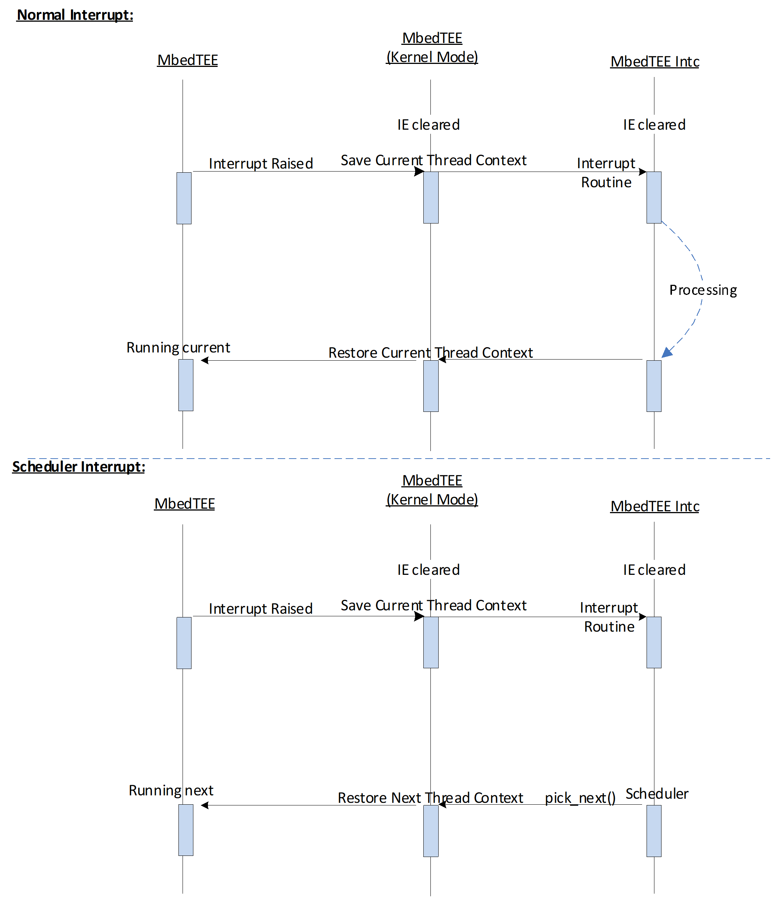

<div align=center STYLE="page-break-after: always;">
    <br/><br/><br/><br/><br/><br/><br/><br/><br/><br/><br/><br/>
    <font size=22 face=“Arial”>
        <b>MbedTEE Software Architecture</b>
        <br/>
        <b>V1.1</b> 
    </font>
    <br/><br/><br/><br/><br/><br/>
</div>


# Revision History

| Date       | Reference Code | Summary of Changes |
| ---------- | -------------- | ------------------ |
| 06/15/2019 | V1.0           | First Release      |
| 12/28/2022 | V1.1           | Add RISCV          |

<div STYLE="page-break-after: always;"></div>

# Notice

## License

SPDX-License-Identifier: Apache-2.0

## Copyright

Copyright © 2019 Kapa.XL All Rights Reserved**.**

<div STYLE="page-break-after: always;"></div>

# Abbreviation and Acronyms

**ACL** Access Control List

**API** Application Programming Interface

**ASID** Address Space ID

**ASLR** Address Space Layout Randomization

**DMA** Direct Memory Access

**DRAM** Dynamic Random Access Memory

**DSO** Dynamic Shared Object

**ELF** Executable and Linkable Format

**EOF** End of File

**FIFO** First In First Out

**FD** File Descriptor

**FAT** File Allocation Table

**FIQ** Fast Interrupt Request

**FS** File system

**GIC** Generic Interrupt Controller

**GP** Global Platform

**ID** Identifier

**IPC** Inter Process Communication

**IPI** Inter Processor Interrupt

**IRQ** Interrupt Request

**ISR** Interrupt Service Routine

**IO** Input Output

**IP** Intellectual Property

**MMU** Memory Management Unit

**MSGQ** Message Queue

**OS** Operating System

**OTP** One Time Programmable

**POSIX** Portable Operating System Interface

**RPC** Remote Procedure Call

**RPMB** Replay Protected Memory Block

**SMC** Secure Monitor Call

**SMP** Symmetric Multi-Processing

**TA** Trusted Application

**TEE** Trusted Execution Environment

**UART** Universal Asynchronous Receiver Transmitter

<div STYLE="page-break-after: always;"></div>

# Preface

## Content of the document 

- This document explains the software architecture behind MbedTEE software, including:

  - Introduction of the basic concept of MbedTEE operating system.

  - Introduction of the MbedTEE kernel components.


  - Introduction of the MbedTEE kernel security.

## References from the document

\[1\]: “DDI0406C_d_armv7ar_arm.pdf”

\[2\]: “DDI0487G_a_armv8_arm.pdf”

\[3\]: “riscv-volume2-privileged-20211203.pdf”

\[4\]: “GPD_TEE_SystemArch_v1.2_PublicRelease.pdf”

\[5\]: “GPD_TEE_Internal_Core_API_Specification_v1.2.1_CC.pdf”

\[6\]: “GPD_TEE_Client_API_v1.0_EP_v2.0.pdf”

<div STYLE="page-break-after: always;"></div>

# Contents

[Revision History](#revision-history)

[Notice](#notice)

​	[I License](#license)

​	[II Copyright](#copyright)

[Abbreviation and Acronyms](#abbreviation-and-acronyms)

[Preface](#preface)

​	[I Content of the document](#content-of-the-document)

​	[II References from the document](#references-from-the-document)

[Contents](#contents)

[List of figures](#list-of-figures)

[List of tables](#list-of-tables)

------

[Chapter 1 Introduction](#chapter-1---introduction)

[1.1 What is MbedTEE](#11-what-is-mbedtee)

[1.2 What is TA](#12-what-is-ta)

[1.3 Hardware Architecture](#13-hardware-architecture)

​	[1.3.1 ARM TrustZone based architecture](#131-arm-trustzone-based-architecture)

​	[1.3.2 RISCV based architecture](#132-riscv-based-architecture)

​	[1.3.3 MIPS based architecture](#133-mips-based-architecture)

------

[Chapter 2 Overview](#chapter-2---overview)

[2.1 Working Model](#21-working-model)

[2.2 Processor Initialization](#22-processor-initialization)

[2.3 Exception Levels](#23-exception-levels)

​	[2.3.1 Exception Levels of ARM](#231-exception-levels-of-arm)

​	[2.3.2 Exception Levels of RISCV](#232-exception-levels-of-riscv)

​	[2.3.3 Exception Levels of MIPS](#233-exception-levels-of-mips)

[2.4 Multi-threading](#24-multi-threading)

​	[2.4.1 Thread](#241-thread)

​	[2.4.2 Process](#242-process)

​	[2.4.3 User thread](#243-user-thread)

​	[2.4.4 Kernel thread](#244-kernel-thread)

​	[2.4.5 Thread ID](#245-thread-id)

​	[2.4.6 POSIX Thread ID](#246-posix-thread-id)

​	[2.4.7 Process ID](#247-process-id)

[2.5 Scheduler](#25-scheduler)

​	[2.5.1 SCHED_FIFO](#251-sched_fifo)

​	[2.5.2 SCHED_RR](#252-sched_rr)

​	[2.5.3 SCHED_OTHER](#253-sched_other)

​	[2.5.4 Priority](#254-priority)

​	[2.6 Exception Handling](#26-exception-handling)

------

[Chapter 3 Context Switch](#chapter-3---context-switch)

[3.1 Context Switch of ARM](#31-context-switch-of-arm)

​	[3.1.1 REE SMC](#311-ree-smc)

​	[3.1.2 TEE SMC](#312-tee-smc)

​	[3.1.3 AArch32 SVC](#313-aarch32-svc)

​	[3.1.4 AArch64 SVC](#314-aarch64-svc)

​	[3.1.5 AArch32 Interrupt](#315-aarch32-interrupt)

​	[3.1.6 AArch64 Interrupt](#316-aarch64-interrupt)

[3.2 Context Switch of RISCV](#32-context-switch-of-riscv)

​	[3.2.1 System Call](#321-system-call)

​	[3.2.2 Interrupt](#322-interrupt)

[3.3 Context Switch of MIPS](#33-context-switch-of-mips)

​	[3.3.1 System Call](#331-system-call)

​	[3.3.2 Interrupt](#332-interrupt)

------

[Chapter 4 MbedTEE Components](#chapter-4---mbedtee-components)

[4.1 Overview](#41-overview)

[4.2 System Call](#42-system-call)

[4.3 Heap Manager](#43-heap-manager)

[4.4 Page Manager](#44-page-manager)

[4.5 Timer Framework](#45-timer-framework)

[4.6 Synchronization Primitives](#46-synchronization-primitives)

[4.7 Tasklet](#47-tasklet)

[4.8 Workqueue](#48-workqueue)

[4.9 IPI](#49-ipi)

[4.10 RPC](#410-rpc)

[4.11 IPC](#411-ipc)

[4.12 ELF Loader](#412-elf-loader)

[4.13 MMU](#413-mmu)

[4.14 File System](#414-file-system)

​	[4.14.1 FS types](#4141-fs-types)

​	[4.14.2 FS Operations](#4142-fs-operations)

[4.15 Storage](#415-storage)

​	[4.15.1 Transient](#4151-transient)

​	[4.15.2 Persistent](#4152-persistent)

[4.16 DTB](#416-dtb)

[4.17 GlobalPlatform](#417-globalplatform)

------

[Chapter 5 TEE Security](#chapter-5---tee-security)

[5.1 Isolation](#51-isolation)

​	[5.1.1 REE-TEE Isolation](#511-ree-tee-isolation)

​	[5.1.2 User-Kernel Isolation](#512-user-kernel-isolation)

​	[5.1.3 TA Isolation](#513-ta-isolation)

[5.2 ELF Mapping](#52-elf-mapping)

[5.3 Timer](#53-timer)

​	[5.3.1 Overview](#531-overview)

​	[5.3.2 Monotonic Counter](#532-monotonic-counter)

​	[5.3.3 Time Category](#533-time-category)

[5.4 Debugging](#54-debugging)

[5.5 Access Control Policy](#55-access-control-policy)

[5.6 IPC Security](#56-ipc-security)

​	[5.6.1 Message Queue](#561-message-queue)

​	[5.6.2 File descriptor sharing](#562-file-descriptor-sharing)

[5.7 RPC Security](#57-rpc-security)

[5.8 Image Security](#58-image-security)


------


# List of figures

[Figure 1‑1 ARM TrustZone Based Architecture](#figure-1-1-arm-trustzone-based-architecture)

[Figure 1‑2 FVP_VE_Cortex_A15x4 Processors](#figure-1-2-fvp_ve_cortex_a15x4-processors)

[Figure 1‑3 RISCV Based Architecture](#figure-1-3-riscv-based-architecture)

[Figure 1‑4 QEMU RISCV Processors](#figure-1-4-qemu-riscv-processors)

[Figure 1‑5 MIPS32 Based Architecture](#figure-1-5-mips32-based-architecture)

[Figure 2‑1 Client is from REE](#figure-2-1-client-is-from-ree)

[Figure 2‑2 Client is another TA](#figure-2-2-client-is-another-ta)

[Figure 2‑3 Processor 0 Initialization Flow](#figure-2-3-processor-0-initialization-flow)

[Figure 2‑4 Secondary Processor Initialization Flow](#figure-2-4-secondary-processor-initialization-flow)

[Figure 2‑5 Exception Levels of AArch32@ARMv7-A](#figure-2-5-exception-levels-of-aarch32armv7-a)

[Figure 2‑6 Exception Levels of AArch64@ARMv8-A/ARMv9-A](#figure-2-6-exception-levels-of-aarch64armv8-aarmv9-a)

[Figure 2‑7 Exception Levels of RISCV](#figure-2-7-exception-levels-of-riscv)

[Figure 2‑8 Exception Levels of MIPS](#figure-2-8-exception-levels-of-mips)

[Figure 3-1 Synchronous SMC Call - AArch32](#figure-3-1-synchronous-smc-call---aarch32)

[Figure 3‑2 Synchronous SMC Call - AArch64](#figure-3-2-synchronous-smc-call---aarch64)

[Figure 3‑3 Asynchronous SMC Call - AArch32](#figure-3-3-asynchronous-smc-call---aarch32)

[Figure 3‑4 Asynchronous SMC Call - AArch64](#figure-3-4-asynchronous-smc-call---aarch64)

[Figure 3‑5 System Call – AArch32](#figure-3-5-system-call---aarch32)

[Figure 3‑6 System Call – AArch64](#figure-3-6-system-call---aarch64)

[Figure 3‑7 FIQ Interrupts the REE - AArch32](#figure-3-7-fiq-interrupts-the-ree---aarch32)

[Figure 3‑8 FIQ Interrupts the REE (Scheduled) - AArch32](#figure-3-8-fiq-interrupts-the-ree-scheduled---aarch32)

[Figure 3‑9 FIQ - AArch32](#figure-3-9-fiq---aarch32)

[Figure 3‑10 MbedTEE Forwards IRQ to REE - AArch32](#figure-3-10-mbedtee-forwards-irq-to-ree---aarch32)

[Figure 3‑11 TEE IRQ Interrupts the REE - AArch64](#figure-3-11-tee-irq-interrupts-the-ree---aarch64)

[Figure 3‑12 TEE IRQ Interrupts the REE (Scheduled) - AArch64](#figure-3-12-tee-irq-interrupts-the-ree-scheduled---aarch64)

[Figure 3‑13 REE IRQ Interrupts the TEE - AArch64](#figure-3-13-ree-irq-interrupts-the-tee---aarch64)

[Figure 3‑14 TEE IRQ - AArch64](#figure-3-14-tee-irq---aarch64)

[Figure 3‑15 System Call - RISCV](#figure-3-15-system-call---riscv)

[Figure 3‑16 Interrupt – RISCV](#figure-3-16-interrupt---riscv)

[Figure 3‑17 System Call - MIPS](#figure-3-17-system-call---mips)

[Figure 3‑18 Interrupt - MIPS](#figure-3-18-interrupt---mips)

[Figure 4‑1 MbedTEE Components](#figure-4-1-mbedtee-components)

[Figure 4‑2 Persistent storage based on reefs](#figure-4-2-persistent-storage-based-on-reefs)

[Figure 5‑1 AArch32 Address Space](#figure-5-1-aarch32-address-space)

[Figure 5‑2 AArch64 Address Space](#figure-5-2-aarch64-address-space)

[Figure 5‑3 RISCV32 SV32 Address Space](#figure-5-3-riscv32-sv32-address-space)

[Figure 5‑4 RISCV64 SV39 Address Space](#figure-5-4-riscv64-sv39-address-space)

[Figure 5‑5 MIPS32 Address Space](#figure-5-5-mips32-address-space)

[Figure 5‑6 PS information](#figure-5-6-ps-information)

# List of tables

[Table 1‑1 OS information - ARM](#table-1-1-os-information---arm)

[Table 1‑2 Communication Method - ARM](#table-1-2-communication-method---arm)

[Table 1‑3 OS information - RISCV](#table-1-3-os-information---riscv)

[Table 1‑4 Communication Method - RISCV](#table-1-4-communication-method---riscv)

[Table 5‑1 Kernel ELF Segments](#table-5-1-kernel-elf-segments)

[Table 5‑2 TA ELF Segments](#table-5-2-ta-elf-segments)


<div STYLE="page-break-after: always;"></div>

#  Chapter 1 - Introduction

## 1.1 What is MbedTEE

MbedTEE is an implementation of Trusted Execution Environment (TEE) for embedded devices, it’s a real time operating system which comply with POSIX and GlobalPlatform, it manages the security resources and provides security services to system.

MbedTEE leverages the security architecture in the SoC, it’s explicitly isolated with Rich Execution Environment (REE) and the isolation is enforced by the SoC’s security technology at hardware level, remote procedure call (RPC) is introduced for the REE-TEE communication. TEE has higher security level than REE, and TEE can enable or disable the REE access to some of the hardware resources.

MbedTEE currently supports AArch32, AArch64, Riscv32, Riscv64 and MIPS32R2 architectured processors (CPU).

## 1.2 What is TA

A Trusted Application (TA) is a program that runs in the TEE user space and exposes security services to its clients.

A Trusted Application is command-oriented. Clients access a Trusted Application by opening a session with the Trusted Application and invoking commands within the session. When a Trusted Application receives a command, it parses the messages associated with the command, performs any required processing, and then sends a response back to the client.

A client typically runs in the Rich Execution Environment and communicates with a Trusted Application using the TEE Client API. It is then called a “Client Application”. It is also possible for a Trusted Application to act as a client of another Trusted Application, using the GlobalPlatform Internal Core API. The term “Client” covers both cases.

## 1.3 Hardware Architecture

Before looking into MbedTEE, this section introduces some of possible hardware architectures that the TEE may run at.

- The ARM TrustZone based architecture.

- The RISCV based architecture

- The MIPS based architecture

### 1.3.1 ARM TrustZone based architecture


<center><h6>Figure 1-1 ARM TrustZone Based Architecture</h6></center>

The ARM processor (armv7a, armv8a and armv9a CPU) can work in non-trusted mode and trusted mode, depending on the TrustZone enable or not. The non-trusted mode is design for the rich OS (e.g. Linux) with all non-secure applications. Whereas, the trusted mode is designed for the TEE to execute secure libraries and trusted applications.

Under the ARM TrustZone architecture, the TEE runs at the same processor (CPU) as the REE with the time-sharing scheduling mechanism. TEE and REE are explicitly isolated and this isolation is enforced by the TrustZone and SoC’s security technology at hardware level, only a tiny bridge based on the SMC instruction is used for the REE-TEE communication.

The following figure takes the ARM FVP_VE_Cortex_A15x4 as an example, this SoC is designed to have 4 processors in one CPU cluster, MbedTEE can run on all of these processors with SMP supported, which means SMC instruction can be executed on every processor to request the security services from MbedTEE, MbedTEE will process the requests symmetrically.


<center><h6>Figure 1-2 FVP_VE_Cortex_A15x4 Processors</h6></center>

Seen from the above hardware architectures, ARM SoC supports below software architecture with TEE. Table 1‑1 illustrates the OS information.

<center><h6>Table 1-1 OS information - ARM</h6></center>

| Rich Execution Environment | Trusted Execution Environment |
| :------------------------: | :---------------------------: |
|  ARM Non-Trusted (Linux)   |     ARM Trusted (TEE OS)      |


Table 1‑2 illustrates the communication method between different execution environments.												

<center><h6>Table 1-2 Communication Method - ARM</h6></center>

|          |  REE to TEE   |  TEE to REE   |
| :------: | :-----------: | :-----------: |
|   Data   | Shared memory | Shared memory |
| Commands |      SMC      |   IPI (SGI)   |

The communications between REE and TEE relies on Secure Monitor Call (SMC) instruction or IPI (inter processor interrupt), through which the CPU enters monitor mode from non-secure or secure and then fully switch the context of different worlds.

### 1.3.2 RISCV based architecture


<center><h6>Figure 1-3 RISCV Based Architecture</h6></center>

Due to the RISCV does not have the TrustZone or similar extension, thus the MbedTEE needs to run at a dedicated security processor (CPU). At this case, the REE processor (CPU) is running the rich OS (e.g. Linux) with all non-secure applications. Whereas, the TEE processor is running the MbedTEE to execute secure libraries and trusted applications.

Under this architecture, TEE and REE are explicitly isolated and the isolation is enforced by the SoC’s security technology at hardware level, only a tiny bridge based on the SSWI is used for the REE-TEE communication.

The following figure takes the RISCV32/RISCV64 QEMU virtual platform as an example, this platform is configured to have 8 processors (e.g. qemu-system-riscv64 -M virt -smp 8), MbedTEE can run on all of these processors with SMP supported, which means SSWI interrupt can be served/issued on every processor to request/response the security services from MbedTEE, MbedTEE will process the requests symmetrically.


<center><h6>Figure 1-4 QEMU RISCV Processors</h6></center>

Seen from the above hardware architectures, RISCV virtual platform supports below software architecture with TEE. Table 1‑3 illustrates the OS information.

<center><h6>Table 1-3 OS information - RISCV</h6></center>

|  Rich Execution Environment  | Trusted Execution Environment |
| :--------------------------: | :---------------------------: |
| REE Processors (4~7) (Linux) | TEE Processors (0~3) (TEE OS) |

Table 1‑4 illustrates the communication method between different execution environments.

<center><h6>Table 1-4 Communication Method - RISCV</h6></center>

|          |  REE to TEE   |  TEE to REE   |
| :------: | :-----------: | :-----------: |
|   Data   | Shared memory | Shared memory |
| Commands |     SSWI      |     SSWI      |

The communications between REE and TEE relies on SSWI extension, through which the CPU generates the software interrupt to the other world.

### 1.3.3 MIPS based architecture

Current MbedTEE only supports to run at a single MIPS32R2 processor (CPU), no SMP supported, no REE communication supported.


<center><h6>Figure 1-5 MIPS32 Based Architecture</h6></center>

<div STYLE="page-break-after: always;"></div>

#  Chapter 2 - Overview

## 2.1 Working Model

- Client is from the REE

  

<center><h6>Figure 2-1 Client is from REE</h6></center>

- Client is another TA (instance)

  

<center><h6>Figure 2-2 Client is another TA</h6></center>

## 2.2 Processor Initialization

Take the ARM TrustZone based SoC as example, RISCV/MIPS flow are similar except the secondary processors (CPU) wake up method.

- Processor 0 initialization flow in TEE world:

  

<center><h6>Figure 2-3 Processor 0 Initialization Flow</h6></center>

- Secondary processors initialization flow in TEE world:

  

<center><h6>Figure 2-4 Secondary Processor Initialization Flow</h6></center>

## 2.3 Exception Levels

### 2.3.1 Exception Levels of ARM

The following figure illustrates the exception levels and security states in the AArch32@ARMv7-A processor. (It’s a little bit different with the AArch64@ARMv8-A/ARMv9-A on the S-EL3, AArch64 has the S-EL1 for the TEE kernel and S-EL3 for the secure monitor, which the AArch32@ARMv7-A does not have the S-EL3, the TEE kernel occupies the S-EL1 alongside the secure monitor in the ARMv7-A.)

**EL0**: lowest exception level to execute the REE applications.

**EL1**: privileged exception level to execute the REE kernel.

**EL2**: privileged exception level to execute the Hypervisor.

**S-EL0**: secure exception level to execute the trusted applications.

**S-EL1**: secure exception level to execute the TEE kernel.

**S-EL3**: highest secure exception level to execute the secure monitor routine.


<center><h6>Figure 2-5 Exception Levels of AArch32@ARMv7-A</h6></center>

**Processor modes in the AArch32@ARMv7-A**:

**User**: non-privileged mode for most of the programs and applications.

**SVC**: Entered on reset, or when a SVC instruction is executed.

**System**: privileged mode for the operating system, sharing the registers with User mode.

**FIQ**: Entered on an FIQ interrupt exception

**IRQ**: Entered on an IRQ interrupt exception

**ABT**: Entered on a memory access exception

**UND**: Entered when an undefined instruction is executed


<center><h6>Figure 2-6 Exception Levels of AArch64@ARMv8-A/ARMv9-A</h6></center>

### 2.3.2 Exception Levels of RISCV

**Level 0**: **User** exception level to execute the applications.

**Level 1**: **Supervisor** exception level to execute the kernel.

**Level 2**: Reserved.

**Level 3**: **Machine** exception level, highest privileges.


<center><h6>Figure 2-7 Exception Levels of RISCV</h6></center>

### 2.3.3 Exception Levels of MIPS

**User Mode**: **User** exception level to execute the applications.

**Kernel Mode**: **Kernel** exception level to execute the kernel. The core enters kernel mode both at reset and when an exception is recognized.

**Supervisor Mode**: Not in use.


<center><h6>Figure 2-8 Exception Levels of MIPS</h6></center>

## 2.4 Multi-threading

Most of the modern operating systems provide the multi-threading support and MbedTEE is not different from these operating systems. MbedTEE supports multi-threads as they can provide concurrency or parallelism on the single or multiple processor (CPU) systems.

MbedTEE modules (TA or kernel modules) can attain parallelism by spawning some operations in the background, TA or kernel modules achieve this by delegating these operations to the corresponding user or kernel threads, these threads are independent sequences of execution corresponding to their mission.

**There are diverse definitions of the user and kernel threads under different operating systems, the following sections introduce what they are under the MbedTEE operating systems.**

### 2.4.1 Thread

A thread is an entity within a process that can be scheduled for execution. Each thread has its own scheduling attribute (e.g. scheduling policy and priority), thread local storage, a unique thread identifier, and a set of structures the operating system will use to save/restore the thread context in scheduling. The thread context includes the thread's set of machine registers, the kernel stack and the user stack in its process’s address space.

### 2.4.2 Process

A process is one that only runs at the user space and runs only the TA’s code. Each process is started with a single thread, often called the primary thread, but can create additional threads from any of its threads, each process must have at least one thread of execution. Each process provides the resources needed to execute a program, including a virtual address space, executable code, heap, opened handles to system objects (e.g. file descriptors), device ACL, IPC ACL, a unique process identifier, process configuration (e.g. name and UUID). The process’s resources are visible to all of its threads, that means one thread can share the resource with each other threads within the same process. The process resource is totally not visible to other processes, the resource sharing between processes must go through the explicit IPC.

### 2.4.3 User thread

A user thread is one that runs at the user space, but it can call into kernel space by issuing system call, it’s still considered a user thread even though it can execute kernel code.

MbedTEE provides the complete support of POSIX thread in the user space, each process (TA) can create its own thread(s), new created thread is only visible within the owner process (TA).

### 2.4.4 Kernel thread

A kernel thread is one that only runs at the kernel space and runs only the kernel code, it’s created by the operating system or kernel modules and it’s not associated with any user thread.

Both the user and kernel threads are scheduled by the kernel scheduler.

### 2.4.5 Thread ID

Thread unique identifier within the whole MbedTEE.

### 2.4.6 POSIX Thread ID

Thread unique identifier within its owner process (TA).

### 2.4.7 Process ID

Process unique identifier within the whole MbedTEE, it’s equal to its primary thread ID.

## 2.5 Scheduler

In order to support the multi-threading, MbedTEE supports the POSIX standard scheduler to control the execution of each thread, each thread has its own associated scheduling policy and priority. Associated with each policy is a priority range. Each policy specifies the minimum and maximum priorities for that policy. The priority ranges for each policy may overlap the priority ranges of other policies.

To balance the loading of processors (CPU) which are running at the same MbedTEE, MbedTEE scheduler supports the Symmetric Multi-Processing (SMP) mechanism.

MbedTEE provides the support of following scheduler policies:

### 2.5.1 SCHED_FIFO

Generally, SCHED_FIFO is a real-time scheduling policy known as "first come, first served." This strategy allows real-time processes to run until a higher priority thread arrives or they voluntarily yield the processor (CPU). SCHED_FIFO is suitable for threads that require a strict response time because it ensures that once a thread is executed, it will not be preempted by other threads of same priority.

MbedTEE supports the SCHED_FIFO policy, threads scheduled under this policy are chosen from a thread ready queue that is ordered by the time its threads have been on the queue without being executed; generally, the head of the queue is the thread that has been on the queue the longest time, and the tail is the thread that has been on the queue the shortest time.

- When a SCHED_FIFO thread starts running, it continues to run until it voluntarily gives up CPU or is preempted by a higher priority thread.

- If multiple SCHED_FIFO threads of the same priority are ready to run, the SCHED_FIFO policy requires that the currently running thread must actively yield CPU before subsequent threads of the same priority can run.

- The thread becomes the tail of the thread ready queue under the following cases:

- When a running thread [yield](http://pubs.opengroup.org/onlinepubs/9699919799/functions/sched_yield.html) CPU,

- When a blocked thread becomes a runnable thread,

- When the priority is changed.

When using SCHED_FIFO, be aware that such threads can occupy the CPU for a long time, affecting the execution of other threads on the system. Therefore, such threads should be designed to ensure that they can yield the CPU in a reasonable amount of time to avoid excessive use of system resources.

### 2.5.2 SCHED_RR

MbedTEE supports the SCHED_RR policy, SCHED_RR is a real-time scheduling policy that manages threads on a Round-Robin basis. This policy ensures fairness by allowing threads with the same priority to take turns using CPU resources in the order of time slices. When a thread runs out of time slices, it is placed at the end of the ready queue, waiting for the next dispatch.

The effect of this policy is to ensure that if there are multiple SCHED_RR threads at the same priority, one of them does not monopolize the CPU. An application should not rely only on the use of SCHED_RR to ensure application progress among multiple threads if the application includes threads using the SCHED_FIFO policy at the same or higher priority levels or SCHED_RR threads at a higher priority level.

### 2.5.3 SCHED_OTHER

POSIX defines the policy SCHED_OTHER which is implementation-defined, that allows the operating system define its own specific scheduling policy to improve the portability.

MbedTEE SCHED_OTHER is a dynamic-priority policy, the priority will be auto-decreased after the thread consumed certain CPU time slice, when the priority decreased to the minimum, MbedTEE scheduler will reset its priority to the original one, and so on. This policy ensures that there is no thread with SCHED_OTHER policy can monopolize the CPU. Major of the TAs will use this policy and this is the default policy when creating a thread.

### 2.5.4 Priority

MbedTEE scheduler manages both the kernel and user thread execution, the kernel and user thread have different priority ranges, major of the kernel threads have higher priority than the user thread. The priority differences are listed as below, higher value corresponding to higher priority.

- 0 ~ 63 for the kernel thread priority

- 0 ~ 39 for the user thread priority

- Default kernel thread priority is 44

- Default user thread priority is 16

Kernel thread can set its priority even lower than the user thread, that’s depended on the thread’s mission.

## 2.6 Exception Handling

Exception is a system event or condition that requires to halt the normal execution and instead executes a dedicated software routine known as the exception handler. After the exception has been handled, the operating system resumes the context before taking the exception if there is no context switch required. (refer to the following chapter for the context switch).

**MbedTEE kernel catches all the exceptions and handles all of them to avoid the undefined behaviors of the TEE execution.**

Here takes the AArch32 exceptions as an example (4 kinds of exceptions):

- Interrupt:

  - FIQ: According to the MbedTEE design, the FIQ is dedicated for the TEE world, and all FIQs are routed to the monitor mode. The FIQ is not visible to the REE world, REE world can’t influence any FIQ configurations and exceptions.

  - IRQ: The IRQ is dedicated for the REE world, but it may occur during the MbedTEE execution. In case of the IRQ occurred during the MbedTEE execution, MbedTEE just switch the context to REE instead of responding this IRQ, that means the REE IRQ can interrupt the MbedTEE execution and MbedTEE just forwards the IRQ to REE. A substituted solution is that MbedTEE masks the IRQ during the MbedTEE execution, as thus the IRQ will never be able to interrupt the MbedTEE, but the IRQ latency time will be terrible.
- Aborts:

  - Prefetch aborts on the instruction fetch

  - Data aborts on the data access

  - Undefined aborts
- **Reset**: Reset is the highest priority exception and can’t be masked.
- Software Generated:

  - The supervisor call (SVC) enables the user code to request the kernel service.
- The secure monitor call (SMC) enables the REE to request the TEE service.


<div STYLE="page-break-after: always;"></div>

#  Chapter 3 - Context Switch

## 3.1 Context Switch of ARM

Context switch may happen during any time of the processor (CPU) execution, and may be triggered by the software interrupt or the external interrupt.

There are two kinds of context switches under the ARM TrustZone based MbedTEE architecture, one is the REE-TEE world context switch, another one is the thread context switch inside the MbedTEE.

The following sections illustrate the different handling manners of different cases inside MbedTEE.

### 3.1.1 REE SMC

REE can request the TEE service through the SMC, there are two kinds of function calls can be issued by REE: the synchronous and the asynchronous calls.

#### Synchronous Call

The AArch32 synchronous call is used for the short time request, with this type the monitor routine does not wakeup any MbedTEE threads to respond this call, it handles this kind of calls directly with the FIQ and IRQ masked. Only the REE-TEE world contexts are switched under this type, no context switch of MbedTEE threads.


<center><h6>Figure 3-1 Synchronous SMC Call - AArch32</h6></center>

The AArch64 synchronous call is different with AArch32, AArch64 monitor delegates the EL3 SMC to EL1 SGI, then the synchronous call can be handled in EL1 MbedTEE SGI routine properly.


<center><h6>Figure 3-2 Synchronous SMC Call - AArch64</h6></center>

#### Asynchronous Call

The asynchronous call is used for handling long time request which may lead MbedTEE wait, with this type the monitor routine (or EL1 SGI routine @ AArch64) wakes up a MbedTEE kernel thread (rpc-workqueue) to respond this call by enqueuing a work to the rpc-workqueue. The REE-TEE world context switch and the MbedTEE thread context switch are both involved.

**For the AArch32 SMC:**


<center><h6>Figure 3-3 Asynchronous SMC Call - AArch32</h6></center>

**For the AArch64 SMC:**


<center><h6>Figure 3-4 Asynchronous SMC Call - AArch64</h6></center>

### 3.1.2 TEE SMC

Normally the MbedTEE kernel is working at the AArch32 System mode or AArch64 EL1T, when the MbedTEE kernel needs to request the monitor services, it can also issue the SMC to enter the monitor mode. Currently this kind of TEE SMC (SMC Issued from MbedTEE internal) is only used for the secondary processors power up and power down.

### 3.1.3 AArch32 SVC

AArch32 SVC is the software generated supervisor call to request the kernel service (system call). The following figure illustrates the AArch32 context switch of both the normal SVC and scheduler SVC.


<center><h6>Figure 3-5 System Call - AArch32</h6></center>

### 3.1.4 AArch64 SVC

AArch64 SVC is the software generated supervisor call to request the kernel service (system call). The following figure illustrates the AArch64 context switch of both the normal SVC and scheduler SVC.


<center><h6>Figure 3-6 System Call - AArch64</h6></center>

### 3.1.5 AArch32 Interrupt

#### FIQ Raised during REE Execution

The AArch32 FIQ is dedicated for the MbedTEE and the FIQs are all routed to monitor mode, so when a FIQ is raised during REE execution, the monitor receives this FIQ and switches the context to the MbedTEE, then the MbedTEE corresponding FIQ routine can respond this FIQ.

- If it is a normal FIQ, it isn’t related to any scheduler functionalities.


<center><h6>Figure 3-7 FIQ Interrupts the REE - AArch32</h6></center>

- If it is a FIQ related to MbedTEE scheduler. (e.g. scheduler timer FIQ)


<center><h6>Figure 3-8 FIQ Interrupts the REE (Scheduled) - AArch32</h6></center>

#### FIQ Raised during TEE Execution

Due to the AArch32 FIQ is dedicated for the MbedTEE, so the handler logic is quite simple when the FIQ is raised during MbedTEE execution. Refer to the following figure to know the details of the normal FIQ and scheduler FIQ handler logics.


<center><h6>Figure 3-9 FIQ - AArch32</h6></center>

#### IRQ Raised during TEE Execution

The AArch32 IRQ is dedicated for the REE and the IRQ may occur during the TEE execution, MbedTEE just switches the context to REE instead of responding this IRQ.

After the AArch32 processor context is switched to REE, REE receives this IRQ and handles it immediately.


<center><h6>Figure 3-10 MbedTEE Forwards IRQ to REE - AArch32</h6></center>

#### IRQ Raised during REE Execution

The AArch32 IRQ is dedicated for the REE, so there is no context switch in MbedTEE when the IRQ is raised during REE execution.

###  3.1.6 AArch64 Interrupt 

#### FIQ

The AArch64 FIQ is dedicated for the monitor mode, Monitor FIQ will be asserted on the following cases:

- TEE IRQ raised during REE execution

- REE IRQ raised during TEE execution

For case 1, when a TEE IRQ is raised during REE execution, the processor jumps to the monitor FIQ exception entry, then the monitor switches the context to the MbedTEE, the MbedTEE corresponding IRQ routine will respond this IRQ.

For case 2, when a REE IRQ is raised during TEE execution, the processor jumps to the monitor FIQ exception entry, then the monitor switches the context to the REE, the REE corresponding IRQ routine will respond this IRQ.

- If it is a normal TEE IRQ, it isn’t related to any scheduler functionalities.


<center><h6>Figure 3-11 TEE IRQ Interrupts the REE - AArch64</h6></center>

- If it is a TEE IRQ related to MbedTEE scheduler. (e.g. scheduler timer IRQ)


<center><h6>Figure 3-12 TEE IRQ Interrupts the REE (Scheduled) - AArch64</h6></center>

- REE IRQ raised during TEE execution.


<center><h6>Figure 3-13 REE IRQ Interrupts the TEE - AArch64</h6></center>

#### TEE IRQ Raised during TEE Execution

Refer to the following figure to know the details of the normal TEE IRQ and scheduler TEE IRQ handler logics.


<center><h6>Figure 3-14 TEE IRQ - AArch64</h6></center>

#### REE IRQ Raised during REE Execution

There is no context switch in MbedTEE when the REE IRQ is raised during REE execution.

## 3.2 Context Switch of RISCV

Context switch may happen during any time of the RISCV processor (CPU) execution, and may be triggered by the software interrupt or the external interrupt.

The following sections illustrate the different handling manners of different cases inside MbedTEE.

### 3.2.1 System Call

RISCV supports the ECALL instruction to make a request to the supporting execution environment, MbedTEE trusted application uses such software generated environment call to request the kernel service, which means the system call. The following figure illustrates the context switch on both the normal system call and scheduler system call.


<center><h6>Figure 3-15 System Call - RISCV</h6></center>

### 3.2.2 Interrupt

Refer to the following figure to know the details of the RISCV normal interrupt and scheduler interrupt handler logics.


<center><h6>Figure 3-16 Interrupt - RISCV</h6></center>

## 3.3 Context Switch of MIPS

Context switch may happen during any time of the MIPS processor (CPU) execution, and may be triggered by the software interrupt or the external interrupt.

The following sections illustrate the different handling manners of different cases inside MbedTEE.

### 3.3.1 System Call

MIPS supports the SYSCALL instruction to make a request to the kernel mode, MbedTEE trusted application uses such software generated call to request the kernel service, which means the system call. The following figure illustrates the context switch on both the normal system call and scheduler system call.


<center><h6>Figure 3-17 System Call - MIPS</h6></center>

### 3.3.2 Interrupt

Refer to the following figure to know the details of the MIPS normal interrupt and scheduler interrupt handler logics.




<center><h6>Figure 3-18 Interrupt - MIPS</h6></center>

<div STYLE="page-break-after: always;"></div>

#  Chapter 4 - MbedTEE Components

## 4.1 Overview

MbedTEE kernel is consisted of the fundamental core and the kernel modules.

MbedTEE core provides the basic functionality of an operating system, such as the exception handling, scheduler, heap management, page management, timer framework, thread management, process management, system call, tasklets, workqueue, DTS, IPC, RPC, synchronization primitives and file system etc.

MbedTEE kernel module is Linux-like module to extend the functionality of the core, it’s usually used for describing a SoC peripheral driver. It is piece of code that integrates into the kernel image. But now, it cannot be compiled separately into a dynamic loaded kernel object, so you cannot load or unload dynamically as the Linux module does.


<center><h6>Figure 4-1 MbedTEE Components</h6></center>

**The following sections introduce only the major components of the MbedTEE software.**

## 4.2 System Call

MbedTEE provides the support of system call (syscall) for the TA to request the kernel services. In most of the operating systems, syscalls can only be made from the user space, MbedTEE is not different from these operating systems. System call is an exception that can be caught by the processor’s exception handler which saves the calling thread’s context and prepares the parameters for the destination function, then the handler jumps to the MbedTEE general syscall to process the destination function, the destination function will be executed with the calling thread’s stack.

MbedTEE has quite limited number of syscalls for the security reason, while many other modern operating systems have hundreds of syscalls. (e.g. the Linux has more than 300 syscalls).

Major of the MbedTEE syscalls are defined in the POSIX style which allow the TA to be portable. The popular system calls like open, read, write, ioctl, close, lseek, mmap, stat, readdir, printf, poll, epoll and exit etc. are all supported.

MbedTEE has a C library (libc) in the user space to provide the wrapper functions for the syscalls, the C library is built from the latest newlib with reentrant enabled and retargeted lock for the thread-safety. The C library is released in a dynamic shared object (libc.so), MbedTEE kernel has ELF loader to load such DSOs.

## 4.3 Heap Manager

MbedTEE heap manager provides the service for other kernel components to allocate and free the kernel memory dynamically.

As we all know that dynamic using of the memory pieces will cause the memory fragment, in order to decrease the memory fragmenting, MbedTEE introduces the buddy algorithm to the memory management. Two kinds of allocators in use:

- Buddy allocator – for the small piece which size is almost aligned to power of two.

- Bitmap allocator – for the small piece which size is quite not aligned to power of two.

- MbedTEE heap manager provides the supports on:

- Allocate and free the physically continuous memory, the memory space is mapped with the continuous pages.

- Allocate and free the virtually continuous memory, the memory space is mapped with the scattered pages.

## 4.4 Page Manager

MbedTEE page manager provides the service for other kernel components to allocate and free the kernel pages dynamically.

In order to decrease the page fragmenting, MbedTEE page allocation is under the control of buddy algorithm.

MbedTEE page manager provides the supports on:

- Allocate and free the continuous pages.

- Allocate and free the scattered pages.

## 4.5 Timer Framework

MbedTEE uses the CPU’s generic timer (ARM generic timer, RISCV sstc, RISCV clint timer or MIPS CP0 timer) as the monotonic counter and source of the timer events.

MbedTEE timer framework provides the supports on:

- Get the monotonic system time.

- Get/Set the system time.

- Create and destroy the timer event.

- Start and stop the timer event.

- Renew the timer event.

- Migrating the timer events when CPU hot-plug.

## 4.6 Synchronization Primitives

MbedTEE kernel provides the low-level mechanisms for the thread synchronization.

- atomic operation (32-bits)

- mutual exclusion (ARM 8-bits, others 32-bits)

- spinlock (ARM 8-bits, others 32-bits)

- semaphore (ARM 8-bits, others 32-bits)

- wait queue

When the race conditions of the multi-threading shared resource are inevitable, the synchronization primitive must be introduced to achieve the thread-safety, usually the atomic operation, mutual exclusion, spinlock and semaphore can be used on this case.

## 4.7 Tasklet

MbedTEE tasklet is a Linux-like mechanism for the kernel modules to insert deferred works, it is typically used for handling the bottom halves of the interrupts, taskletd is running with the interrupt unmasked and it has critical priority. With this mechanism the kernel modules can postpone the long time works to the taskletd, this will improve the latency time of the top half interrupt handling.

If a tasklet routine is scheduled from an interrupt context, the taskletd will be executed immediately with its own stack after exited the interrupt routine. If not, MbedTEE kernel raises the softint to execute taskletd ASAP. Linux softint borrows the current interrupted thread's stack when exiting IRQ boundary, unlike the Linux softint execution, MbedTEE uses the taskletd own stack (context) instead of the interrupted thread's stack.

## 4.8 Workqueue

MbedTEE workqueue is a mechanism for the kernel modules to insert deferred works, similar to the tasklet but with lower priority.

Workqueue supports two types of worker threads which are Normal-Priority worker and High-Priority worker, Normal-Priority workers are designed for the works which are not time critical, High-Priority workers are designed for the works which require the strict response time.

Workqueue is designed to follow the policy "first come, first serve", but one workqueue may have several worker threads in parallel, that means workqueue can only ensure the starting order of works in queue, it’s unable to ensure the ending order of these works.

## 4.9 IPI

IPI is the inter processor interrupt and it is essentially the software generated interrupt which relied on the ARM-SGI or RISCV-SSWI, the IPI driver is designed for the following purposes:

- MbedTEE local cross-processor function calls (e.g. SMP TLB maintenance broadcasting)

- REE-TEE remote procedure calls (RPC)

##  4.10 RPC

The communication between REE and TEE is relied on the MbedTEE RPC driver, RPC callee and caller are both existed to provide the bi-directional communication.

RPC driver is implemented based on the IPI (or ARM-SMC) and shared memory (REE memory). Due to the communication between different execution environments breaks the isolation, so the RPC driver enforces the security checks on the parameters to another environment.

Refer to the 5.7 for the detailed security checks.

##  4.11 IPC

MbedTEE provides the POSIX signal, message queue and shared memory mechanisms for the basic TA IPC, the TA communication and resource sharing must go through the explicit IPC. In order to gain better security on the IPC, MbedTEE introduces the additional security checks on the IPC establishment. Refer to the 5.6 for the detailed security checks on the IPC.

##  4.12 ELF Loader

MbedTEE ELF loader is used for loading the ELF object to each TA virtual address space, it supports to load the executable or dynamic shared object (DSO).

ELF loader parses the TA ELF object and allocates the scattered pages for the necessary segments, finally it maps these segments to the TA user space according to read-only/read-write/executable flags in the TA ELF LOADs. The mapping is done by the MMU driver with the TA private translation table.

The DSO is loaded with the similar way, only difference is that there is no extra page allocation for the DSO read-only segments, all the TA share the read-only pages of the DSO but with different user address mappings.

Address Space Layout Randomization (ASLR) is supported, thus the TA can be compiled and linked with the flag ‘pie’ and then ELF loader can load it to a random virtual address to enhance the security; ELF loader also supports to load the executable TA which was not compiled nor linked with ‘pie’ flag.

The ELF loader always uses the ASLR - random virtual address for the DSO loading, thus the sources of the DSO must be compiled with the flag ‘–fPIC’, otherwise the DSO relocation will be abnormal.

##  4.13 MMU

MbedTEE MMU driver focuses on the following functionalities:

- Cache operations

  - Cache clean

  - Cache invalidates

- Translation table management

- ASID management

- Memory mapping

  - Map the physical page to the kernel virtual address

  - Map the physical page to the user virtual address

  - Support the read-only, read-write, executable, non-cacheable and cacheable mapping flags

- Address translation

  - Kernel physical address to kernel virtual address translation

  - Kernel virtual address to kernel physical address translation

  - User virtual address to kernel physical address translation

##  4.14 File System

### 4.14.1 FS types

MbedTEE supports the following File systems:

- fatfs (ram based)

- tmpfs

- devfs

- debugfs

- reefs (flash based)

### 4.14.2 FS Operations

MbedTEE supports the following FS operations:

- open

- read

- write

- ioctl (only for device file)

- poll (only for device file)

- mmap

- close

- lseek

- fstat

- ftruncate

- rename

- unlink

- mkdir

- readdir

- rmdir

##  4.15 Storage

Current MbedTEE support the transient and persistent storage types, one is volatile object while the other one is non-volatile object.

### 4.15.1 Transient

The transient object implementation is quite simple due to MbedTEE supports the tmpfs and fatfs (which are based on ram, so called ramfs here).

TA can leverage the ramfs operations mentioned in 4.14.2 to manage its own transient objects.

### 4.15.2 Persistent

Current MbedTEE has neither the driver/framework for flash devices nor the driver for Replay Protected Memory Block (RPMB) devices, but TA can leverage the reefs operations mentioned in 4.14.2 to manage its own persistent objects.

Persistent file is encrypted and signed by MbedTEE reefs, then it is sent to REE flash-based file system via RPC. Persistent file decryption and validation are also done by MbedTEE reefs before use, so the file’s confidentiality and integrity can be well protected.


<center><h6>Figure 4-2 Persistent storage based on reefs</h6></center>

##  4.16 DTB

MbedTEE supports the Flattened Device Tree (FDT) parser, two ways to specify the DTB of MbedTEE:

- Embedded DTB -> enabled by CONFIG_EMBEDDED_DTB, linked into MbedTEE kernel

- External DTB -> enabled by CONFIG_DTB_ADDR

##  4.17 GlobalPlatform

MbedTEE supports the GlobalPlatform specified TEE working model and APIs.

- TEE Client API (mbedtee-client-api)
- TEE Client Driver (linux/drivers/tee/mbedtee)
- TEE Internal Core API (mbedtee-os/user/tee)


<div STYLE="page-break-after: always;"></div>

#  Chapter 5 - TEE Security

## 5.1 Isolation

This section focuses on the REE-TEE world isolation and User-Kernel space isolation.

### 5.1.1 REE-TEE Isolation

TEE should be isolated with the REE based on the hardware security mechanisms in the SoC and/or the TrustZone security in the ARM processor.

REE and TEE should each have its dedicated physical memory and dedicated hardware IPs in the SoC, SoC architecture/bus design should be able to detect the access is from REE or TEE state, thus the IPs can authorize the different accesses from different states. The detailed memory isolation and IPs isolation for REE and TEE are out of scope of current document, each should be reviewed according to the features of the target product SoC.

From the ARM TrustZone view, in the same processor the isolations are:

- Each has dedicated MMU.

- Each cache line has NS (non-secure) flag, the REE cache operations can’t evict the TEE cache lines.

- Each has dedicated timer (only frequency configuration is shared), only TEE can configure the timer frequency.

- TEE has higher permission in the interrupt controller, TEE determines which interrupt will be routed to TEE and which interrupt can be routed to REE.

- For AArch32, each has dedicated interrupt mode, TEE uses the FIQ while REE uses the IRQ. REE is unable to change the FIQ configuration. For AArch64, each has dedicated IRQ.

- Monitor runs in the secure state only.

- TEE can enable or disable the REE access to some processor functionalities. (e.g. TEE can enable or disable REE access to the floating-point extension).

- TEE instruction fetches from the REE memory is not permitted.

Due to TEE is isolated with REE, so a bridge must be present when REE needs to access the TEE service. Secure monitor acts as the bridge in the ARM TrustZone based architecture.

- Each processor can disable the SMC instruction from REE.

- Each parameter from the REE will be checked to prevent the malicious software attack through the mock parameters.

- Each parameter has a backup in TEE memory before doing the check, this can prevent the TOCTOU (Time of Check / Time of Use) attack.

### 5.1.2 User-Kernel Isolation

MMU is quite a mandatory module for the security, especially for the isolation of the user-kernel address spaces and the isolation of TA process space.

#### Space Isolation

Although the REE and TEE run in the same processor, but the MMU registers are banked (separated) for the secure and non-secure states, that means the REE and TEE each has dedicated MMU configurations. (configurations are related to: translation table base control, translation table base addresses, user and kernel address spaces separation, domain separation, application address space separation, i-cache and d-cache working mode).

Parameter checks are applied:

- With this separation, and the address passed from the user space can be validated easily (pointers from the system calls). E.g. MbedTEE kernel provides the API copy_from_user and copy_to_user for the kernel modules to exchange data with the user space, these APIs validate the user pointer and size by easily check if they are within predefined user space range. All the kernel modules which may involve the user space address must go through these two APIs.

- These APIs also check whether the user space address has the valid entry in the calling TA’s translation table (valid mapping and proper access permission).

##### AArch32 Space Isolation

User-kernel address space separation: AArch32 MMU supports two translation tables, one is used for the user space translation table walk, another one is used for the kernel space translation table walk. Each translation table has dedicated address space and there is no overlap of these two address spaces. According to the hard-coded configuration of the AArch32 MMU driver:

- TTBR0 for User 0x00000000 ~ 0x3FFFFFFF (1GB)

- TTBR1 for kernel 0x40000000 ~ 0xFFFFFFFF (3GB)

AArch32 user space is unable to touch the TTBR1 range directly to injure the kernel space, AArch32 MMU driver enforces the access permission of kernel space to “User no access” if it detects the input translation table is for kernel.


<center><h6>Figure 5-1 AArch32 Address Space</h6></center>

##### AArch64 Space Isolation

User-kernel address space separation: AArch64 MMU supports two translation tables, one is used for the user space translation table walk, another one is used for the kernel space translation table walk. Each translation table has dedicated address space and there is no overlap of these two address spaces. According to the hard-coded configuration of the AArch64 MMU driver:

- TTBR0 for User 0x0000000000000000 ~ 0x0000007FFFFFFFFF (512GB)

- TTBR1 for kernel 0xFFFFFF8000000000 ~ 0xFFFFFFFFFFFFFFFF (512GB)

AArch64 user space is unable to touch the TTBR1 range directly to injure the kernel space, AArch64 MMU driver enforces the access permission of kernel space to “User no access” if it detects the input translation table is for kernel.


<center><h6>Figure 5-2 AArch64 Address Space</h6></center>

##### RISCV32 Space Isolation

According to the hard-coded configuration of the RISCV32 SV32 MMU driver:

- User 0x00000000 ~ 0x7FFFFFFF (2GB)

- Kernel 0x80000000 ~ 0xFFFFFFFF (2GB)


<center><h6>Figure 5-3 RISCV32 SV32 Address Space</h6></center>

##### RISCV64 Space Isolation

According to the hard-coded configuration of the RISCV64 SV39 MMU driver:

- User 0x0000000000000000 ~ 0x0000003FFFFFFFFF (256GB)

- Kernel 0xFFFFFFC000000000 ~ 0xFFFFFFFFFFFFFFFF (256GB)


<center><h6>Figure 5-4 RISCV64 SV39 Address Space</h6></center>

##### MIPS32 Space Isolation

According to the hard-coded configuration of the MIPS32 MMU driver:

- User 0x00000000 ~ 0x7FFFFFFF (2GB)

- Kernel 0x80000000 ~ 0xFFFFFFFF (2GB)


<center><h6>Figure 5-5 MIPS32 Address Space</h6></center>

#### Execution Isolation

According to the section 2.3, the processor provides multiple exception levels, with this hardware separation the user and kernel executions can be explicitly isolated.

- An exception can never be taken into a lower exception level.

- An exception return can never be to a higher exception level.

#### Resource Isolation

According to the previous sections, the processor provides non-privileged and privileged modes. With this hardware enforcement the user and kernel access to the system resources is explicitly separated.

- Each processor mode has its dedicated stack.

- Each processor mode has dedicated registers, except the generic registers are shared with each other. The software exception routines handle the registers properly.

- Non-privileged mode (user) is denied to configure certain system configurations, e.g. MMU configuration, interrupt configuration, monitor configuration, cache configuration and SoC registers etc.

- Non-privileged mode (user) must delegate to the system calls to access the system resources.

### 5.1.3 TA Isolation

- Memory Isolation between TAs:

  - Each TA has its own translation table.

  - Each TA has its own address space.

  - According to the ELF Loader, the pages for storing the TA ELF object are dynamically allocated. TAs can only share the read-only pages of the DSO.

  - Each TA thread has its own stack, the stack pages are dynamically allocated.

  - Each TA has its own heap, the heap pages are dynamically allocated.

  - ALSR applied to each TA.

- Resource Isolation between TAs:

  - The opened object handlers (e.g. file descriptors) are only visible within the owner TA, and they have no meaning in other TA.

  - The resources under the handlers are always dynamically allocated for the multi-session supported modules.

  - The resource sharing between TAs must go through the explicit IPC.

  - Crashes in one TA can’t stop other TA and kernel’s execution. Crashes in one TA are always recoverable, only requiring a restart of the TA but not the entire system.

##  5.2 ELF Mapping

MbedTEE kernel has multiple sections in the ELF binary, and each section has its own MMU mapping flag. With these flags, MbedTEE kernel can easily protect the “.text” and “.rodata” sections from software modification by the processor, but it still can’t prevent the malicious overwrite from the hardware DMA.

<center><h6>Table 5-1 Kernel ELF Segments</h6></center>

| Item    | RW/RO | Exec/non-exec  |
| ------- | ----- | -------------- |
| .text   | RO    | Executable     |
| .rodata | RO    | Non-Executable |
| .init   | RO    | Executable     |
| .data   | RW    | Non-Executable |
| .ramfs  | RW    | Non-Executable |
| .bss    | RW    | Non-Executable |

The TA also has multiple ELF sections and each section has its own MMU mapping too. The TA memory is dynamically allocated by MbedTEE kernel during TA loading, and TA memory segments will be mapped to the virtual user space with the associated flags.

According to the ELF LOAD flags in the program header, the TA is always mapped as follow. Generally, each TA has two LOAD segments, one is for the read-only but executable sections, the other one is for the read-write by non-executable sections.

<center><h6>Table 5-2 TA ELF Segments</h6></center>

| Item     | RW/RO | Exec/non-exec  |
| -------- | ----- | -------------- |
| .hash    | RO    | Executable     |
| .dynsym  | RO    | Executable     |
| .dynstr  | RO    | Executable     |
| .rel.dyn | RO    | Executable     |
| .rel.plt | RO    | Executable     |
| .text    | RO    | Executable     |
| .rodata  | RO    | Executable     |
| .dynamic | RW    | Non-Executable |
| .got     | RW    | Non-Executable |
| .data    | RW    | Non-Executable |
| .bss     | RW    | Non-Executable |

## 5.3 Timer

### 5.3.1 Overview

In this chapter, at first it briefly goes through the HW mechanism that is provided to guarantee secure timer. And next it introduces how to manage the time in MbedTEE.

### 5.3.2 Monotonic Counter

MbedTEE has a dedicated timer (ARM generic timer, RISCV sstc, RISCV clint timer or MIPS CP0 timer) which is isolated with the REE. This timer provides the monotonic counter and the system timer events with interrupt supported.

After started, the monotonic counter will ONLY increase. It will not decrease or stop as long as the power supplies. It guarantees the time is monotonic from HW.

### 5.3.3 Time Category

MbedTEE supports Global Platform Time APIs. The API provides access to three sources of time:

- System Time

  - The System Time is also known as TEE time, which is calculated from the Monotonic Counter. The System time is not required to be equal to the real time of the real world, but it’s monotonic after the system boots.

- TA Time

  - The GlobalPlatform TEE_GetTAPersistentTime function retrieves the persistent time of the TA expressed as a number of seconds and milliseconds since the arbitrary origin set by calling TEE_GetTAPersistentTime, the persistent time of each TA is so-called TA Time.

  - TA Time has following features:

  - TA Time source is not from HW Timer, but from corresponding TA.

  - TA Time can be different from System time.

  - One TA Time can be different from another TA Time.

  - One TA only supports one persistent time at any moment.

  - TA Time is set / updated by TA through GP API, but this time is also required monotonic.

- REE Time

  - The REE Time is time retrieved from REE side. In normal case, the REE time source is from REE timer. The timer is not required to be secure. Therefore, the REE Time should not be considered as trusted, as it may be tampered by the user or the REE software.

> In GlobalPlatform time API, when a TA sets the TA persistent time at the first time, the kernel records the time offset between the System Time and such TA Time. When a TA gets the TA persistent time after some moment, GlobalPlatform time API gets the current System Time, gets the time offset, calculate the current TA time, and return it back to TA.
>
> To keep the TA time monotonic, when a TA updates an existed TA persistent time, GlobalPlatform time API will check if the new TA persistent time to be updated is greater than the current TA persistent time. If the new TA time is not greater than current TA time, the request would be rejected.

## 5.4 Debugging

- To ensure the security, the following mechanisms can only be enabled at development stage:

  - User backtrace

  - Kernel backtrace

  - User TA print to the serial terminal

  - Kernel prints the critical message (e.g. TA abort reason or kernel panic/oops messages)

  - Ps supported with necessary thread information


<center><h6>Figure 5-6 PS information</h6></center>

## 5.5 Access Control Policy

Each TA has one ACL (Access Control List) alongside the TA configuration. Example:

```
name = "shell";

uuid = "eb2f9996-9430-4905-a4fc-8476736e0d7b";

path = "/apps/shell.elf";

version = "1.0.1";

stack_size = "8192";

heap_size = "1048576";

single_instance = "1";

multi_session = "0";

inst_keepalive = "0";

dev_access = "/dev/uart0, /dev/uart1, /dev/urandom, /dev/globalplatform";

ipc_access = "xxx";
```

The ACL contains two access control policies:

- Device Access Control, which prevents unauthorized access to devices by the TA. The TA is only authorized to access the devices specified in the **dev_access** list.

- IPC Access Control, which prevents unauthorized IPC with the peer TA. The TA is only authorized to have the IPC with the TAs specified in the **ipc_access** list.

## 5.6 IPC Security

### 5.6.1 Message Queue

MbedTEE provides standard POSIX message queues for sharing messages between TA.

According to the section 5.5, MbedTEE kernel enforces the check on the IPC between TAs. MbedTEE kernel records the *name* of each **mq_open** to the kernel IPC session list along with the owner’s information. There are multiple processing logics on the establishment:

- if the name does not exist in the IPC session list, kernel will create a new IPC session (**O_CREAT** will also be considered) and record this IPC name, new generated IPC descriptor and the calling TA’s name/PID to this session, the IPC descriptor will also be recorded to the calling TA’s kernel structure (process structure in kernel).

- if the name already exists in the IPC session list, then kernel checks if the calling TA has the right to establish the IPC on this session, the session owner’s name must be present in the calling TA’s **ipc_access** list. If granted, the calling TA’s name/PID will be recorded to the session structure, also the IPC descriptor will be recorded to the calling TA’s kernel structure (process structure in kernel). The reference counter of this session will be increased by 1.

When using the send, receive or other functions, the kernel performs the checks on the IPC descriptor, the descriptor must be present in the calling TA’s kernel structure, otherwise permission deny will be returned.

### 5.6.2 File descriptor sharing

In order to allow explicit file descriptor sharing between TA, the POSIX message queues has been extended with the following functions, where fd is the file descriptor to be shared:

```
mq_send_fd(mq_descriptor, fd)

mq_receive_fd(mq_descriptor, &fd)
```

These functions have the following security checks in the kernel:

- **ipc_access** check which was already introduced in above section

- **dev_access** check is also involved, the receiver must have the access right to the FD associated device.

When access is granted, the FD will be duplicated on the same resource to the receiver’s process space, and thus the reference counter of this resource will be increased by 1. The MbedTEE kernel releases the resource when both TA close their file descriptor.

## 5.7 RPC Security

- All the RPC parameters should be checked.

- All the RPC pointers and their size should be checked to ensure the TEE memory/IP are not involved, MbedTEE kernel provides API to check if the input pointer/size within, overlap or totally cover the TEE memory.

- All the RPC structures should have backup in TEE memory, MbedTEE uses the backup in TEE to check the parameter to avoid the TOCTOU.

## 5.8 Image Security

TA and certificates in MbedTEE are encrypted and signed with the following cryptographies:

AES-128 CBC CTS \[FIPS 197 (AES) NIST SP800-38A Addendum (CTS = CBC-CS3))\]

RSA-2048 SHA256 \[PKCS#1_V1.5\]
